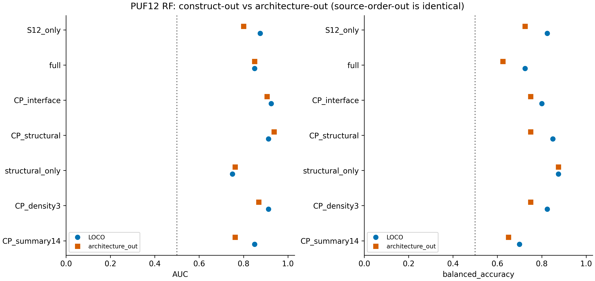

# PUF AlphaFold CP analysis

利用 AlphaFold 接触概率、结构置信度和几何特征，研究 PUF repeat 排列的构建成败与 TRM 变化后的位点编辑表现。构建成功、C388活性保留、C295/C871编辑下降分别建模。

[干实验 DBTL：设计、构建、测试与学习](docs/DRY_LAB_DBTL.md) · [复现说明](docs/REPRODUCIBILITY.md)

## 当前分析入口

| 任务 | 数据与主要结果 | 入口 |
|---|---|---|
| 骨架跨排列验证 | 24个PUF12，4成功/20失败；三密度RF跨排列AUC0.86875，CP＋结构RF0.9375 | [报告](architecture_validation/PUF_architecture_validation_report.md) |
| C388联合动态阈值 | 31构建；40%标签、CP＋结构LR，训练内选分数阈值的组留出BA80.7%，LOCO67.9% | [报告](c388_threshold/README.md) |
| C871/C295动态标签分类 | 固定入组22突变体；位置组合选出候选的组留出BA为87.5%/73.2% | [报告](trm22_offtarget/REPORT.md) |
| C388活性保留 | 22入组突变体，ΔC388≥−15 pp；Interface_CP浅层RF固定0.5，位置组合BA93.75%、留一85.42% | [阶段性结果](c388_local_nonlocal_optimization/README.md) |

不同任务的样本范围、标签和验证方式见各报告。BA为平衡准确率。所有模型仍为研究候选，尚无独立新构建验证的最终联合筛选器。

## 骨架分析

三密度浅层RF使用S4/S12/S24：序列间隔至少4/12/24、CP>0.5的蛋白内部接触对数除以蛋白长度。LOCO AUC0.9125，跨排列AUC0.86875；跨排列检出3/4成功，误报5/20失败。

CP＋结构RF跨排列AUC0.9375，但默认0.5阈值仅检出2/4成功。仅结构RF的跨排列BA为87.5%、AUC0.7625。排序与固定阈值分类需分别判断。所有主集仍共享前部R123；当前验证覆盖后部repeat排列迁移。architecture-out与source-order-out在此数据中为同一分组。

[全部指标](architecture_validation/validation_metrics.csv) · [折外预测](architecture_validation/heldout_predictions.csv) · [构建标签](architecture_validation/construct_registry.csv) · [特征定义](architecture_validation/CP_summary_dictionary.csv)



## 编辑功能分析

WT相对标签使用突变体编辑率减去同位点WT编辑率，单位为百分点。C871/C295当前分析固定使用C388阶段的22个入组突变体，扫描下降幅度标签，并分别报告留一构建、位置组合留出和严格位置留出。不同标签定义与验证方式下的最佳值均属探索性结果。

最新C388候选的Interface_CP实际为全蛋白–RNA CP矩阵相对WT的RMS变化。固定阈值组留出BA93.75%来自多候选探索；训练内联合选择特征、模型与分数阈值时BA为50%。该结果尚未确立稳定泛化。完整protein–protein CP相关的nonlocal/coupling工作仍待补齐输入。

[最新C388比较表](c388_local_nonlocal_optimization/results/comparison_metrics.csv) · [关键预测](c388_local_nonlocal_optimization/results/key_predictions.csv) · [独立核验](c388_local_nonlocal_optimization/INTEGRATION_AUDIT.json)

## 保留目录与历史整理

| 目录 | 用途 |
|---|---|
| `architecture_validation/` | 当前骨架主分析与敏感性结果 |
| `combined12/` | 两批PUF12合并训练、跨批次比较 |
| `new_batch/` | 第二批输入、映射与已保存结果 |
| `c388_threshold/` | 动态阈值流程，使用自身inputs缓存 |
| `trm22_offtarget/` | 22个固定入组突变体的C871/C295动态标签、多特征方法与三类验证 |
| `c388_local_nonlocal_optimization/` | C388阶段性结果快照，完整重跑仍需原ZIP |
| `data/architecture_inputs/` | 当前流程必需的序列、矩阵、特征与映射 |

初始CP、扩展结构、RF调参、TRM迁移检查和C388固定50%独立分析目录已按2026-09-20整理要求删除。旧的30突变体C871/C295动态、WT相对及C295优化阶段也已由22个固定入组的新分析取代。相关基线、失败探索及质控结论集中于 [Dry Lab DBTL](docs/DRY_LAB_DBTL.md)，并链接清理前固定Git版本以便追溯。

## 使用与核验

从仓库根目录、Python 3.12环境运行：

```bash
python -m pip install -r requirements.txt
python tools/validate_snapshot.py
python c388_local_nonlocal_optimization/verify_results.py
```

三密度骨架评分：

```bash
python architecture_validation/predict.py --features new_construct_features.csv --out new_construct_scores.csv
```

输入需包含 `pp_nonlocal4_high_per_res`、`pp_nonlocal12_high_per_res`、`pp_nonlocal24_high_per_res`，按同一蛋白范围和model→seed→construct规则聚合。分数未经校准。

从缓存重现骨架统计、模型、图表和报告：

```bash
python tools/reproduce_current.py
```

该命令会覆盖输出，建议独立checkout。原始AF3大型ZIP不入Git；[输入清单](docs/raw_input_inventory.json)记录来源。训练集重拟合评分不用于报告泛化。完整运行范围及当前删除阶段的复现边界见 [复现说明](docs/REPRODUCIBILITY.md)。
