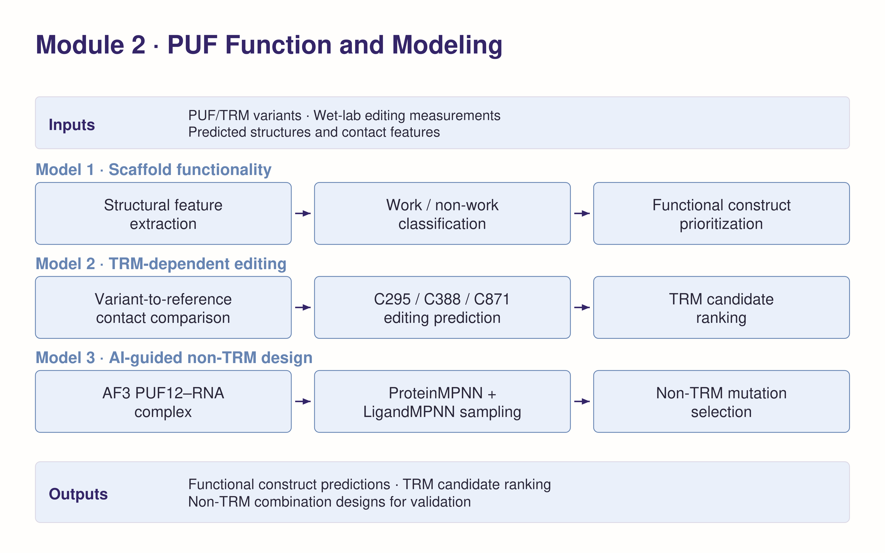

# PUF–APOBEC: structure-guided RNA editing

### From scaffold selection to selective editing and non-TRM design

We combine protein–RNA structure analysis, interpretable classifiers and inverse folding to guide PUF–APOBEC engineering. Our objective is to retain editing at **C388** while reducing bystander editing at **C295 and C871**.

**[Read the full Dry Lab Wiki →](wiki/PUF_Model_EN.md)** · [Figures and captions](wiki/figures/captions.md) · [Module 2 DBTL](research/docs/DRY_LAB_DBTL.md) · [Research files](research/README.md) · [GitHub](https://github.com/pdx12320/PUF_alphafold)

## Our modelling workflow

| Design question | Approach | Experimental connection |
|---|---|---|
| Which repeat arrangements retain function? | Contact-based scaffold screening | Compare work/non-work predictions with four recorded outcomes. |
| Which recognition motifs improve editing profiles? | Endpoint-specific TRM classifiers | Compare predictions with C295, C388 and C871 measurements for five constructs. |
| Which surrounding residues merit testing? | ProteinMPNN and LigandMPNN sequence sampling | Nominate non-TRM substitutions for matched-background experiments. |

## 1 · Contact-based scaffold screening

A decision-tree baseline identified informative contact features. A shallow random forest subsequently combined contact and structural descriptors. It is trained on twenty scaffolds with all four test designs excluded together, and agrees with **3/4** subsequent experimental outcomes. That panel contains one work and three non-work constructs.

[Model rationale and experimental comparison →](wiki/PUF_Model_EN.md#model-1-contact-based-scaffold-screening)

## 2 · Balancing target and bystander editing

Separate models predict control-relative editing classes at the three reporter sites. All five test candidates are excluded together before preprocessing, model selection and fitting. Models trained on the remaining 76 constructs agree with **11 of 15 experimental endpoint classes**: C295 **5/5**, C388 **3/5** and C871 **3/5**. The project workflow advances predicted candidates to subsequent wet-lab testing.

C388 now uses a −5 pp boundary and a CP-only Ridge model. Its fixed-panel agreement is 3/5 versus a 2/5 majority baseline, but nested LOCO on the 76 training constructs gives 60.4% balanced accuracy versus 61.8% for the matched baseline. The complete selection procedure therefore has no established baseline advantage. [C388 results and full validation](research/c388_binary/README.md).

Retained contact attribution highlights **P3/P5/P2 for C295** and **P1/P10/P11 for C871**, with additional C871 signal outside repeat cores. The former C388 attributions belong to its archived three-class model; C388 attribution has not been re-estimated.

[Editing profiles and model interpretation →](wiki/PUF_Model_EN.md#model-2-balancing-target-and-bystander-editing)

## 3 · Exploring non-TRM sequence space

ProteinMPNN and LigandMPNN each generated **10,000 sequences** from the PUF structural input. After recognition-code filtering, both models nominated the same alternative amino acid at **17 non-TRM positions**. These candidates connect structural sequence preferences to the next round of wet-lab comparisons.

The **P10** repeat contains four consensus non-TRM candidates. The Wiki also compares exact experimentally tested TRM substitutions with both sampling models and displays favourable measured examples, including the P4/P7-SNE combination.

[Sampling workflow and exact substitutions →](wiki/PUF_Model_EN.md#model-3-exploring-non-trm-sequence-space-with-aice)

## Explore the evidence

| Page | What you will find |
|---|---|
| [Full model narrative](wiki/PUF_Model_EN.md) | Background, model explanations, evaluation, experimental connections and APA references |
| [Figure gallery](wiki/figures/captions.md) | Five current figures with captions and editable vector exports |
| [Engineering cycle](research/docs/DRY_LAB_DBTL.md) | Design–Build–Test–Learn across the three models |
| [Research index](research/README.md) | Source data, scripts, outputs, provenance and historical analyses |
| [Reproducibility](research/docs/REPRODUCIBILITY.md) | Environment, validation and execution commands |

The repository is organized into two folders: **`wiki/` for presentation** and **`research/` for supporting analyses**. All displayed measurements and predictions come from the recorded source tables.
