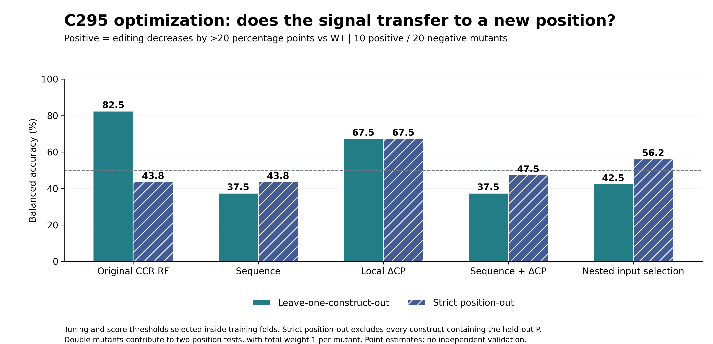

# PUF AlphaFold CP analysis

## 固定阈值模型保留与清理（2026-09-17）

已删除C388固定50%标签下表现接近随机的三个权重：`RNA4_LR`、`RNA4_RF`、`Structure6_RF`。保留三密度Logistic、CP＋结构Logistic及其余有一定信号的候选；architecture模型和C295局部ΔCP继续保留。完整比较结果与失败记录仍可核查，动态阈值分析不变。

[逐项指标与清理说明](c388_analysis/C388_analysis_report.md) · [模型保留清单](c388_analysis/model_retention.json)。保留模型均为研究候选，尚需独立验证。

## C295 固定相对WT标签优化（2026-09-08）

[结果与完整分析过程](c295_optimization/README.md) · [全部指标](c295_optimization/results/all_model_performance.csv) · [逐构建折外预测](c295_optimization/results/all_outer_predictions.csv)

固定正类为 **ΔC295 < −20个百分点**，比较序列、局部ΔCP、两者组合，每个输入族26套参数。新验证在测试某个P位置时，从训练集排除所有包含该P的构建，双突变按预测次数倒数加权汇总。

| 方法 | 留一BA | 严格位置留出BA |
|---|---:|---:|
| 原CCR RF，同一新验证 | 82.5% | 43.8% |
| 序列 | 37.5% | 43.8% |
| 局部ΔCP | 67.5% | 67.5% |
| 序列＋ΔCP | 37.5% | 47.5% |
| 输入族也在训练折内选择 | 42.5% | 56.2% |

局部ΔCP的严格位置precision为43.5%，recall为100%；P4/P5测试组均全判为正类，尚无可靠组内区分。当前属于探索性候选，未建立可部署的最终模型。与下方旧版“位置组合分组”验证不同，不能直接比较其分数。




## 相对 WT 动态阈值分类修正版（2026-09-08）

[结果、过程与复现说明](wt_relative_classification/README.md) · [完整分析过程](wt_relative_classification/PROCESS.md) · [逐突变体预测](wt_relative_classification/results/wt_relative_per_construct_predictions.csv)

全部30个突变体，标签定义为 **Δ编辑效率＝突变体编辑率−对应位点WT编辑率（百分点）**。候选Δ分界：C388 **−45 pp**、C871 **−25 pp**、C295 **−20 pp**；留一／位置组合分组平衡准确率分别为 **76.0%／78.0%**、**78.5%／79.4%**、**82.5%／52.5%**。负分界区分下降较多与下降较少／提高，不能将类别1统称为提高。

本轮已重新拟合并核验：固定WT平移不改变完整扫描的候选分组，两轮所有对应折外分数一致。分界与模型仍经全数据探索筛选；位置组合分组可能共享单个突变位置，未证明对所有全新位置的泛化。下面的绝对分界版本保留供审计，本批结果优先引用相对WT修正版。

## 历史绝对编辑率动态阈值分类（本批 30 个突变体）

新增 [完整结果、方法与复现说明](dynamic_classification/README.md)。取消 C388 >50% 入组条件，分别建模 C388/C871/C295；WT 仅作参考。训练内动态分数阈值的留一／突变位置组合留出 BA：C388 **76.0%／78.0%**，C871 **78.5%／79.4%**，C295 **82.5%／52.5%**。编辑率候选分界分别为 30%、45%、约12.84%。这些分界与模型经本批数据筛选，仍属探索性；C295 跨位置泛化不足。

本目录使用当前上传批次的 30 个突变体，不包含 WT 训练样本，与下方旧版 31 构建分析的样本范围不同。

## 最新更新：C388 编辑率预测与联合阈值分析（2026-09-08）

新增 **31 个 TRM 构建**的 C388 实验终点分析。以两次编辑率均值 ≥50% 定义 work 时为 22 work / 9 non-work；与下方历史 architecture 构建成功标签是不同终点。

- [C388 50% 固定标签报告](c388_analysis/C388_analysis_report.md)：旧模型直接迁移、低维 LR/RF 重训、嵌套模型选择、敏感性分析。
- [C388 × 模型分数联合阈值结果](c388_threshold/README.md)：28 种不等价标签划分、LOCO 与 TRM 突变位置分组留出。
- 在两类均至少 5 个构建时，分组留出的探索性最佳 balanced accuracy 对应 **C388≥40%、CP＋结构 Logistic 分数≥0.459（约0.46）**：accuracy 80.6%、balanced accuracy 82.9%。训练折内选分类阈值后为 77.4%、80.7%；同方案普通 LOCO 分别为64.5%、67.9%，尚不稳定。
- C388 30%、分数0.376 的 LOCO accuracy 90.3%，但 balanced accuracy 仅70.0%。不能用类别失衡或事后挑阈值的最高分宣称模型成熟。
- [全部联合扫描表](c388_threshold/joint_threshold_results.csv) · [逐构建分数](c388_threshold/joint_predictions.csv) · [训练内阈值验证](c388_threshold/joint_inner_threshold_validation.csv) · [复现命令与过程](c388_threshold/REPRODUCE.md)

此次 TRM 分组留出不等于 architecture-out。C388 40%／分数0.46 是待独立验证的候选，已保存的 C388 joblib 模型仍对应50%标签。

## 历史 architecture 分析

PUF构建成功/失败的结构特征分析、可解释模型与跨repeat排列验证。此仓库整理了当前项目的全部分析阶段、结果表、图、模型和代码；研究终点为 **construct work / non-work**，不等同于C295/C388/C871编辑效率。

## Architecture 阶段结论

主数据集：两批 **24种PUF12，4 success / 20 failure，7种architecture**。先对model/seed聚合，每个construct一行。PUF11及TRM变体分别做敏感性分析。

- S4/S12/S24高CP非局部接触密度仍是优先保留的低维特征，但与architecture背景相关。
- 三密度RF：LOCO AUC **0.9125** → architecture-out **0.86875**；失败误报2→5，成功检出均3/4。
- CP＋置信度/几何RF：architecture-out AUC **0.9375**，但阈值0.5时仅检出2/4个成功构建。
- 原CCR01在扩充数据中未复现；局部CCR/残基/接触对没有一致提高泛化。
- 所有主集构建仍共享前部R123；当前证据只覆盖后部repeat排列迁移。architecture-out与source-order-out在当前定义下为同一分组，不能作为两份独立验证。
- 模型分数未校准；4个成功样本不足以证明普适结构机制或成熟预测性能。

[完整最新报告](architecture_validation/PUF_architecture_validation_report.md) · [全部模型指标](architecture_validation/validation_metrics.csv) · [逐构建留出预测](architecture_validation/heldout_predictions.csv) · [构建与标签](architecture_validation/construct_registry.csv)


## 分析阶段与文件位置

| 目录 | 数据/用途 | 状态 |
|---|---|---|
| [previous/results](previous/results) | 最初14种构建，3成功/11失败，原CP summary分析 | 历史基线，含PUF11 |
| [extended](extended) | 原14种的结构扩展、残基映射、CCR、模型 | 历史发现集；旧CCR结论已由最新分析复核 |
| [new_batch](new_batch) | 第二批15种设计的序列、repeat和初始冻结评分 | 其中12种PUF12；ID9/10/11为15-repeat |
| [combined12](combined12) | 两批24种PUF12，4成功/20失败 | 合并训练、LOCO与跨批次检查 |
| [rf_tuning](rf_tuning) | 16组RF参数×3组特征，嵌套LOCO | 调参未整体超过浅层基线 |
| [trm_validation](trm_validation) | WT与P8-R6-GVE，各配三个RNA | 同一骨架变体；额外N端7 aa的事后敏感性检查 |
| [architecture_validation](architecture_validation) | 主集24种＋PUF11/TRM敏感性、精确置换、architecture-out | **当前主要结果** |

历史文件保留原始内容和当时语境。优先采用最新architecture报告，不把不同数据集/特征定义的AUC混在一起。[分析沿革与限制](docs/ANALYSIS_HISTORY.md)。

## 环境与快速使用

建议Python 3.12，从仓库根目录执行：

```bash
python -m venv .venv
source .venv/bin/activate
python -m pip install -r requirements.txt
python tools/validate_snapshot.py
```

推荐三密度浅层RF：300棵树，深度2，叶节点至少2个样本，balanced类别权重。输入CSV必须包含 `pp_nonlocal4_high_per_res`、`pp_nonlocal12_high_per_res`、`pp_nonlocal24_high_per_res`，并按原定义聚合到construct级：

```bash
python architecture_validation/predict.py \
  --features new_construct_features.csv --out new_construct_scores.csv
```

输出包含未校准RF分数、0.5阈值分类及训练范围外标记。先统一蛋白分析范围；N/C端标签变化会影响按长度归一化的密度。范围内也不意味着已验证泛化。

如从原格式AlphaFold ZIP计算三密度，使用 [combined12/predict.py](combined12/predict.py)；其ZIP模式要求`*_rna_*_seedN`目录结构，并采用适用于当前scaffold的motif计数。TRM变体等其他命名/序列须先按明确映射提取特征，不能盲用motif过滤。

## 重现最新统计与模型

仓库含构建级CP/PAE/残基数组及特征缓存，重现最新结果无需再次折叠。以下命令会重写对应结果文件：

```bash
python tools/reproduce_current.py
```

顺序为`stats.py → models.py → plot_static.py → finish.py → write_report.py`，所有脚本从仓库根目录运行。若只检查输入、标签、分组和文件完整性，使用`tools/validate_snapshot.py`。

[完整重现说明](docs/REPRODUCIBILITY.md) · [14项CP summary定义/范围/重要性](architecture_validation/CP_summary_dictionary.csv) · [全部特征字典](architecture_validation/feature_dictionary_ranges_importance.csv)

## 数据与图

- [architecture分组](architecture_validation/architecture_registry.csv)、[实际repeat与残基映射](architecture_validation/all_residue_mapping.csv)
- [单变量检验：效应量、精确p、BH q](architecture_validation/all_univariate_statistics.csv)
- [组内方向](architecture_validation/within_architecture_directions.csv)、[候选混杂诊断](architecture_validation/candidate_confounding_diagnostics.csv)
- [CCR注释](architecture_validation/CCR_regions_annotated.csv)、[关键接触对](architecture_validation/top_contact_pairs_mapped.csv)
- [重要性](architecture_validation/feature_importance.png)、[成功/失败分布](architecture_validation/success_failure_distributions.png)、[architecture分布](architecture_validation/architecture_feature_distributions.png)
- [repeat CP热图](architecture_validation/repeat_pair_heatmap.png)、[逐构建相邻界面](architecture_validation/adjacent_interface_heatmap.png)、[CCR热图](architecture_validation/CCR_heatmap.png)、[留出分数](architecture_validation/heldout_probabilities.png)

对应PDF也在同一目录。`refit_training_scores_NOT_CV.csv`仅为最终重拟合模型的训练集评分，不能用来报告泛化性能。

原始AF3大型ZIP（含MSA/templates）作为外部输入，未重复上传至Git；路径、大小及校验值见[原始输入清单](docs/raw_input_inventory.json)。全部已生成分析结果、图、模型及用于统计/建模重现的缓存已归档。[文件校验清单](docs/file_manifest.json)。


