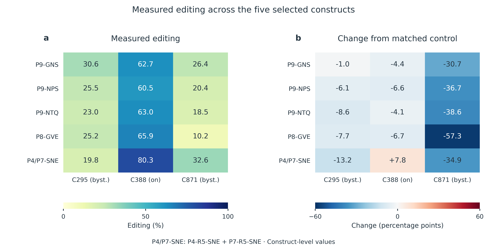

# From PUF scaffold selection to selective RNA editing

## Background and engineering objective

PUF proteins recognize RNA through an array of repeats, each contributing a small set of base-recognition residues (Wang et al., 2002). These residues can be redesigned to change RNA sequence preference (Cheong & Hall, 2006). Repeat expansion also changes the architecture and binding properties of the RNA-binding domain (Zhao et al., 2018).

Our PUF–APOBEC system couples this programmable recognition scaffold to RNA editing. The engineering objective is to retain editing at the reporter target, C388, while reducing editing at the reporter bystander sites, C295 and C871. This requires decisions at three levels: repeat arrangement, recognition motifs and the surrounding protein sequence. AlphaFold 3 predictions provided structural inputs for contact analysis and sequence design (Abramson et al., 2024).

| Model | Biological question | Computational output | Wet-lab connection |
|---|---|---|---|
| **1. Scaffold function** | Which repeat arrangements support a functional PUF scaffold? | Work/non-work classification from protein contacts | Four-design comparison with one work and three non-work outcomes |
| **2. TRM-dependent editing** | Which recognition-motif changes retain target editing and reduce bystander editing? | Separate predictions for C295, C388 and C871 | Five experimentally characterized constructs with complementary editing profiles |
| **3. Non-TRM design** | Which surrounding residues should be tested on favourable TRM backgrounds? | Inverse-folding nominations and mutation combinations | G0–G10 candidate sequences for the next experimental round |

The sections follow **background → model → evaluation → experimental comparison → design consequence**. The comparisons use construct-held-out predictions and existing experimental records. They describe retrospective validation; Model 3 adds computational proposals for a subsequent wet-lab round.

## Model 1. Selecting functional PUF scaffolds

### Background: repeat rearrangement requires structural support

Changing repeat order or inserting loops can alter the organization of the PUF scaffold. We asked whether protein-internal contacts could distinguish arrangements with different experimental work/non-work outcomes. Here, “work” follows the recorded work/non-work label; C388 editing activity is evaluated separately in Model 2.

### Model explanation: from a decision rule to a shallow tree ensemble

We represented each structure by contact-probability (CP) summaries. For a sequence separation of at least $d$ residues, the density of high-probability contacts was

$$
S_d=\frac{1}{L}\sum_{i<j,\;j-i\geq d}\mathbf{1}(CP_{ij}>0.5),\qquad d\in\{4,12,24\}.
$$

Each residue pair contributes once, and $L$ is the analyzed protein length. A larger value indicates more qualifying contacts per residue. Structure-level features were averaged within seeds and then across seeds, giving one feature vector per construct.

A depth-one decision tree established the initial classification rule. Feature selection was repeated within each training fold and consistently selected S12. We then used shallow ensembles of decision trees to combine contact density with additional structural information.

The three-feature random forest used S4, S12 and S24. Its nine-feature companion added core pLDDT mean and minimum, mean PAE, contact-weighted PAE, normalized radius of gyration and anisotropy. Both used 300 trees, maximum depth two, minimum leaf size two, balanced class weights and random seed 2026. Scores of at least 0.5 produced a work prediction. These scores are uncalibrated classifier outputs.

### Training and held-out performance

The initial decision-tree analysis correctly classified all 14 constructs under leave-one-construct-out evaluation, including three work and eleven non-work cases. The three-feature random forest reproduced this separation. Restricting that evaluation to the twelve PUF12 constructs also retained complete agreement.

After the PUF12 collection was expanded, the nine-feature forest correctly classified 22 of 24 constructs under leave-one-construct-out evaluation. Balanced accuracy was 0.850 and ROC-AUC was 0.913. This expanded evaluation included one false positive and one false negative.

*Figure 1. Scaffold classification under leave-one-construct-out evaluation. Rows show recorded experimental classes and columns show predicted classes. The nine-feature random forest classified 19 non-work and three work constructs correctly; one construct in each class was misclassified. Every plotted prediction excluded that construct from fitting.*

### Experimental comparison: one work and three non-work designs

For the four-design assessment, we trained the nine-feature forest on the remaining twenty constructs and predicted all four excluded designs. We then compared these predictions with their wet-lab labels.

| Construct | Work score | Model prediction | Experimental outcome |
|---|---:|---|---|
| Design 1: R123/R567/R567/R67-no-loop-8 | 0.854 | Work | **Work** |
| Design 3: R123/R567/R56-loop-7/R678 | 0.172 | Non-work | Non-work |
| Design 7: R123/R567/R567/R-loop-67-loop-8 | 0.680 | Work | Non-work |
| Design 8: R123/R567/R567/R6-loop-7-loop-8 | 0.431 | Non-work | Non-work |

The experimental panel contained **one work construct and three non-work constructs**. Predictions agreed with three of the four outcomes. Design 1 received the highest score and received a work outcome in the wet-lab record. Design 7 remained a false positive, showing why scaffold prioritization still requires experimental testing.

*Figure 2. Four-design experimental comparison. All four constructs were excluded simultaneously from the fit. The matrix shows one true positive, two true negatives and one false positive. Predictions come from the nine-feature random forest.*

### What this gives the wet lab

The model provides a structural criterion for prioritizing repeat arrangements and identifies Design 1 as a candidate with a matching recorded work outcome. The false positive motivates checking additional determinants of construct function. Once a functional scaffold is available, the next question concerns its editing profile.

Source records: [scaffold protocol](../../results_20260922/scaffold_RF/audit/protocol.json), [metrics](../../results_20260922/scaffold_RF/results/metrics.csv), [predictions](../../results_20260922/scaffold_RF/results/predictions_indexed.csv) and [historical decision-tree analysis](https://github.com/pdx12320/PUF_alphafold/blob/958de2cc3567671c8f9c452cf819aa2133b630d5/previous/results/PUF_CP_report.md).

## Model 2. Connecting TRM changes to reporter editing

### Background: target retention and bystander reduction require separate endpoints

The tripartite recognition motif (TRM) defines a repeat's base-recognition code. Changing this motif can produce different effects at the target and the two bystander sites. We modeled all three editing endpoints separately and compared each variant with its matched experimental control.

For site $s$, the editing change was

$$
\Delta E_s=100\left(E_{s,\mathrm{variant}}-E_{s,\mathrm{control}}\right),
$$

where editing fractions lie between zero and one. Changes are reported in percentage points (pp). Negative C295 or C871 changes indicate lower bystander editing; C388 changes quantify target-activity retention or improvement.

### Model explanation and fitting

The workflow used protein–RNA contact changes as structural inputs, including local, distal, full-matrix and reference-interface feature sets. The selected classifier and feature family could differ between endpoints and training folds. Saved selections included regularized linear models, support-vector methods, discriminant analysis and tree ensembles.

For C295 and C871, the classifier distinguished a reduction beyond the selected threshold from smaller changes. C388 used three classes: decrease, within the selected interval and increase. Thresholds were selected in the training workflow and are recorded for every held-out prediction. Consequently, the labels describe fold-specific biological boundaries.

The evaluation withheld each construct in turn, fitted the workflow using the remaining constructs and predicted the omitted construct. A construct's own editing outcome was excluded from its corresponding fit. Variants at the same repeat position could remain in training.

### Evaluation: complete cohort and five-construct assessment

The complete combined protein–RNA evaluation provides the context for reading the five highlighted candidates.

| Endpoint | Correct held-out predictions | Balanced accuracy | Matched baseline balanced accuracy |
|---|---:|---:|---:|
| C295 | 57/81 | 0.703 | 0.519 |
| C388, three classes | 36/81 | 0.433 | 0.399 |
| C871 | 49/81 | 0.610 | 0.687 |

Performance varied by endpoint, and the C871 model did not exceed the matched baseline in this evaluation. The selected five-construct comparison therefore serves as a detailed case study of useful experimental profiles. These constructs were selected for presentation based on their experimental outcomes.

Across those five constructs, predicted and experimental classes agreed at **13 of 15 endpoints**: five of five for C295, four of five for C388 and four of five for C871. The disagreements were C388 for P9-GNS and C871 for P8-GVE.

*Figure 3. Prediction–measurement agreement for the five highlighted constructs. Each construct was withheld individually, using its saved cross-validation prediction. “Interval” denotes the fold-specific C388 interval. All five C871 observations belonged to the decrease class, so this panel cannot estimate C871 specificity. Thresholds and predictions are supplied in the source table.*

### Wet-lab findings: five complementary editing profiles

We compared the held-out predictions with measurements for P9-GNS, P9-NPS, P9-NTQ, P8-GVE and P4-R5-SNE+P7-R5-SNE. All five retained substantial C388 editing and showed lower measured C295 and C871 editing than their matched controls.

| Construct | C295 editing | C388 editing | C871 editing | ΔC295 (pp) | ΔC388 (pp) | ΔC871 (pp) |
|---|---:|---:|---:|---:|---:|---:|
| P9-GNS | 30.55% | 62.68% | 26.37% | −1.03 | −4.40 | −30.70 |
| P9-NPS | 25.52% | 60.46% | 20.39% | −6.07 | −6.62 | −36.68 |
| P9-NTQ | 23.03% | 62.98% | 18.46% | −8.55 | −4.10 | −38.60 |
| P8-GVE | 25.22% | 65.86% | 10.23% | −7.74 | −6.70 | −57.27 |
| P4-R5-SNE+P7-R5-SNE | 19.80% | 80.34% | 32.60% | −13.15 | +7.77 | −34.90 |

P8-GVE showed the largest C871 reduction in this panel, while retaining 65.86% C388 editing. P9-NTQ combined a modest C388 change with reductions at both bystander sites. The double-SNE construct increased C388 editing by 7.77 pp and reduced C295 and C871 by 13.15 and 34.90 pp, respectively.

These measurements identify useful backbones for continued engineering. The classifiers recovered most of their recorded endpoint classes. The experimental measurements establish the specific editing advantages of each candidate.

*Figure 4. Experimental profiles of the five TRM constructs. Absolute editing percentages and matched-control changes are shown separately. Each change uses the control associated with that construct; controls differ between experimental groups. Values are archived construct-level summaries, with no inferred error bars or significance claims.*

### What this gives the wet lab

P8-GVE and the P9 variants provide backgrounds for investigating reduced C871 editing with retained target activity. The P4/P7 double-SNE construct provides a complementary route that increases C388 editing. These are experimentally grounded positional priorities. The current classifiers do not supply validated individual-residue importance scores.

Source records: [five-construct predictions, thresholds and measurements](../../results_20260922/five_construct_holdout/predictions.csv), [complete cohort predictions](../../results_20260922/v4/all81_LOCO.csv) and [matched-baseline evaluation](../../results_20260922/v4/main_metrics.csv). The separate [ten-construct simultaneous holdout](../../results_20260922/ten_construct_holdout/ranking.csv) uses a different protocol and remains a distinct analysis.

## Model 3. Designing mutations outside the TRM recognition code

### Background: preserve useful recognition motifs and explore the surrounding scaffold

Models 1 and 2 established a route from scaffold selection to experimentally useful TRM backgrounds. We next examined substitutions outside the recognition code. Such substitutions offer testable hypotheses about scaffold organization and the protein–RNA interface while preserving the chosen TRMs.

We adapted the AiCE framework, AI-informed constraints for protein engineering, to structure-conditioned sequence sampling (Fei et al., 2025). This module applies pretrained inverse-folding models to nominate mutations. The PUF editing measurements guide background selection and interpretation.

### Model explanation: structure, sampling, filtering and combination

| Step | Input and operation | Output |
|---|---|---|
| **1. Define the structural reference** | Use the predicted 493-residue PUF12 complex with a 17-nt APOE4 RNA segment; map repeats and recognition positions | A shared protein reference and explicit residue numbering |
| **2. Sample compatible sequences** | Generate 10,000 sequences per model at temperature 0.5 | ProteinMPNN and LigandMPNN sequence ensembles |
| **3. Scan every position** | Count WT and alternative amino-acid frequencies across all 493 positions | Position-specific sequence preferences |
| **4. Protect the recognition code** | Apply the configured recognition-position filter after sampling and retain supported non-TRM changes | 81 nominated positions, including 17 same-substitution dual-model nominations |
| **5. Combine with experimental backgrounds** | Add selected non-TRM substitutions to P8-GVE, P9-NTQ or P7-SYVIRR | Eleven candidate sequences, G0–G10 |
| **6. Return to the wet lab** | Compare candidates with their backgrounds using C295, C388 and C871 measurements | A direct test of the proposed substitutions |

ProteinMPNN conditions sequence generation on the protein backbone (Dauparas et al., 2022). LigandMPNN additionally uses the surrounding atomic context, including RNA atoms (Dauparas et al., 2025). Both use the same structural reference, with different conditioning information.

Sampling covered the protein sequence without fixing TRM positions during generation. Recognition positions were protected during candidate filtering and construction of the final sequences. For this run, the implemented frequency filter used a threshold of 0.8; all exported positions had the flexible-region flag set to false. No task-specific retraining of either MPNN model was performed.

### Sampling results: explicit non-TRM mutation nominations

The screen identified **17 substitutions supported by both inverse-folding models**. Both models favoured the same alternative amino acid at these positions. The table separates substitutions used in the proposed core set from further consensus candidates.

| Design use | Exact substitutions | Interpretation |
|---|---|---|
| Consensus set used in the proposed core combinations | **T350V, D374E, M458L, L274I, T278I, V366I** | Test a combined change to the surrounding scaffold |
| N-terminal-region candidate | **R45T** | Test an additional change near the fusion-end region |
| Further dual-model nominations | **V294I, L166I, R93K, E351L, R462L, V208E, A136E, V388E, A244E, S100E** | Extend the candidate pool with single-mutant comparisons |
| Additional interface proposals | A438G, H392D | Supported by one model at the stated threshold; included in G4 and G8 |
| Additional N-terminal proposals | S30A, L41R; N12S as an exploratory design choice | Included in geometry combinations; N12S has the nomination-label discrepancy described below |

*Figure 5. Sampling frequencies for the exact 17 consensus substitutions. Each value is the fraction of 10,000 generated sequences carrying the indicated residue in one model. Frequency describes structural sequence preference. It does not estimate the probability of improved RNA editing.*

The broader 81-position export requires an additional identity check. At N12, the ProteinMPNN frequency above the threshold supports **N12G**, while the proposed construct contains **N12S**. We retain N12S as an exploratory design choice and document the discrepancy in the [Model 3 methods page](../../aice_mpnn_20260922/README.md). Neither substitution has a measured editing benefit in this release.

Residue numbers refer to the full **493-residue reference protein**. N12 identifies its twelfth residue; TRM positions 12, 13 and 16 refer to positions within a repeat. Numbering should be mapped explicitly when using constructs with different terminal sequences.

### Wet-lab handoff: G0–G10

The proposed core set contains T350V, D374E, M458L, L274I, T278I and V366I. The interface set contains A438G and H392D. The geometry set contains N12S, S30A and L41R. These names describe design hypotheses without establishing their molecular effects.

| Construct | TRM background | Added non-TRM substitutions |
|---|---|---|
| G0 | P8-GVE | None; matched background control |
| G1 | P8-GVE | R45T |
| G2 | P8-GVE | Core set |
| G3 | P8-GVE | R45T + core set |
| G4 | P8-GVE | Interface set |
| G5 | P8-GVE | Geometry set |
| G6 | P8-GVE | R45T + core + interface + geometry sets |
| G7 | P9-NTQ | R45T + core set |
| G8 | P9-NTQ | R45T + interface set |
| G9 | P8-GVE + P9-NTQ | R45T + core set |
| G10 | P7-SYVIRR | Core set |

The next experiment should compare each combination with its corresponding TRM background. Single-mutant comparisons can identify which substitutions contribute to the measured response. G0–G10 are computational designs in the current release; their non-TRM effects remain to be measured.

Source records: [sampling and filtering methods](../../aice_mpnn_20260922/README.md), [493-position scan](../../aice_mpnn_20260922/results/aice_single_ranked.csv), [nomination export](../../aice_mpnn_20260922/results/recommended_mutations.csv), [G0–G10 mutation lists](../../aice_mpnn_20260922/results/gen3_constructs.csv) and [candidate sequences](../../aice_mpnn_20260922/results/gen3_constructs.fasta).

## Integration into the engineering cycle

The three models address successive design decisions. Scaffold modeling prioritizes repeat arrangements, TRM analysis identifies useful experimental editing profiles, and inverse folding proposes changes around those recognition motifs. The resulting wet-lab handoff contains named backgrounds, exact substitutions and three measurable editing endpoints.

The experimental records support the work prediction for Design 1 and reveal complementary editing profiles among the five TRM constructs. The non-TRM candidates extend this evidence into a testable next round. Their results can refine the choice of individual substitutions and combinations.

## Data, figures and reproducibility

All quantitative displays were regenerated from archived prediction and measurement tables. No wet-lab values, model predictions or labels were changed during this revision. Confusion matrices use held-out predictions and retain every error within the displayed panels.

The [figure script](scripts/make_figures.py), [figure source data](figure_data/) and [vector exports](figures/) accompany this page. The [results index](../../results_20260922/README.md) distinguishes the scaffold, five-construct, ten-construct and full-cohort evaluation protocols. Historical analyses remain available through the [engineering record](../DRY_LAB_DBTL.md).

### Page-structure references

We used the [Heidelberg 2024 Model page](https://2024.igem.wiki/heidelberg/model), [Jiangnan-China 2024 Model page](https://2024.igem.wiki/jiangnan-china/model) and [Hamburg 2025 Dry Lab page](https://2025.igem.wiki/hamburg/drylab) as organizational examples. Their useful shared pattern connects a biological question, a defined modeling procedure, displayed evidence and a concrete experimental decision.

## References

Abramson, J., Adler, J., Dunger, J., Evans, R., Green, T., Pritzel, A., Ronneberger, O., Willmore, L., Ballard, A. J., Bambrick, J., Bodenstein, S. W., Evans, D. A., Hung, C.-C., O’Neill, M., Reiman, D., Tunyasuvunakool, K., Wu, Z., Žemgulytė, A., Arvaniti, E., … Jumper, J. M. (2024). Accurate structure prediction of biomolecular interactions with AlphaFold 3. *Nature, 630*(8016), 493–500. https://doi.org/10.1038/s41586-024-07487-w

Cheong, C.-G., & Hall, T. M. T. (2006). Engineering RNA sequence specificity of Pumilio repeats. *Proceedings of the National Academy of Sciences, 103*(37), 13635–13639. https://doi.org/10.1073/pnas.0606294103

Dauparas, J., Anishchenko, I., Bennett, N., Bai, H., Ragotte, R. J., Milles, L. F., Wicky, B. I. M., Courbet, A., de Haas, R. J., Bethel, N., Leung, P. J. Y., Huddy, T. F., Pellock, S., Tischer, D., Chan, F., Koepnick, B., Nguyen, H., Kang, A., Sankaran, B., … Baker, D. (2022). Robust deep learning–based protein sequence design using ProteinMPNN. *Science, 378*(6615), 49–56. https://doi.org/10.1126/science.add2187

Dauparas, J., Lee, G. R., Pecoraro, R., An, L., Anishchenko, I., Glasscock, C., & Baker, D. (2025). Atomic context-conditioned protein sequence design using LigandMPNN. *Nature Methods, 22*(4), 717–723. https://doi.org/10.1038/s41592-025-02626-1

Fei, H., Li, Y., Liu, Y., Wei, J., Chen, A., & Gao, C. (2025). Advancing protein evolution with inverse folding models integrating structural and evolutionary constraints. *Cell, 188*(17), 4674–4692.e19. https://doi.org/10.1016/j.cell.2025.06.014

Wang, X., McLachlan, J., Zamore, P. D., & Hall, T. M. T. (2002). Modular recognition of RNA by a human Pumilio-homology domain. *Cell, 110*(4), 501–512. https://doi.org/10.1016/S0092-8674(02)00873-5

Zhao, Y.-Y., Mao, M.-W., Zhang, W.-J., Wang, J., Li, H.-T., Yang, Y., Wang, Z., & Wu, J.-W. (2018). Expanding RNA binding specificity and affinity of engineered PUF domains. *Nucleic Acids Research, 46*(9), 4771–4782. https://doi.org/10.1093/nar/gky134
