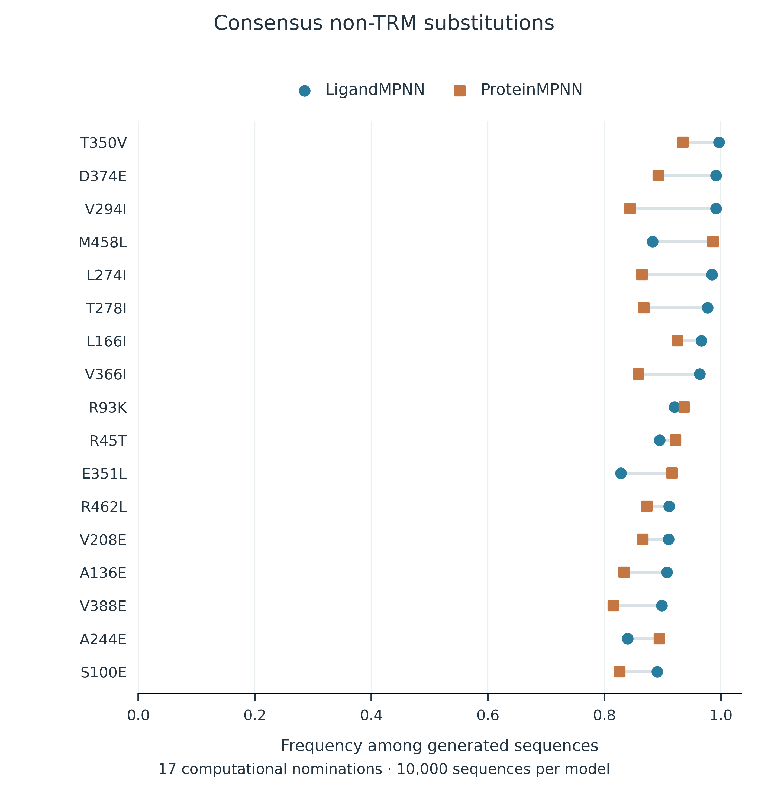

# 从 PUF 骨架筛选到选择性 RNA 编辑

## 背景与工程目标

PUF 蛋白通过串联重复单元识别 RNA，每个重复单元中的少数残基参与碱基识别（Wang et al., 2002）。改变这些残基可以调整蛋白对 RNA 序列的偏好（Cheong & Hall, 2006）。增加重复单元还会改变 RNA 结合域的整体构型与结合性质（Zhao et al., 2018）。

我们的 PUF–APOBEC 系统将可编程的 RNA 识别骨架与 RNA 编辑功能结合。工程目标是在保留报告系统靶位点 C388 编辑活性的同时，降低旁观者位点 C295 和 C871 的编辑。为此，我们分别研究重复单元排列、识别基序和周围蛋白序列三个层面的设计问题。AlphaFold 3 预测结构为接触分析和序列设计提供了结构输入（Abramson et al., 2024）。

| 模型 | 生物学问题 | 计算输出 | 与湿实验的衔接 |
|---|---|---|---|
| **1. 骨架功能** | 哪些重复单元排列能够形成具有功能的 PUF 骨架？ | 根据蛋白内部接触进行 work/non-work 分类 | 对照四个设计的实验结果，其中一个 work、三个 non-work |
| **2. TRM 与编辑表现** | 哪些识别基序改变能够保留靶位点编辑并降低旁观者编辑？ | 分别预测 C295、C388 和 C871 的编辑变化类别 | 分析五个具有互补编辑表现的实验构建 |
| **3. 非 TRM 设计** | 在有利的 TRM 背景上，哪些周围残基值得进一步测试？ | 逆折叠模型推荐的突变及其组合 | 提供用于实验测试的非 TRM 突变候选 |

各节按照**背景 → 模型 → 评价 → 实验比较 → 设计启示**展开。实验比较使用按构建留出的预测结果和已有实验记录，属于回顾性验证。模型三进一步提出用于后续湿实验的计算候选。

## 模型一：基于结构接触的骨架筛选

### 重复单元排列为何重要

改变重复单元的顺序或插入 loop，可能影响 PUF 骨架的组织方式。我们希望判断，蛋白内部接触能否区分实验中表现为 work 与 non-work 的排列。这里的 work 沿用原始 work/non-work 记录标签；C388 编辑活性在模型二中单独评价。

### 学习结构判别规则

我们用接触概率（contact probability，CP）的汇总特征描述每个结构。对于序列间隔至少为 $d$ 个残基的接触，高概率接触密度定义为

$$
S_d=\frac{1}{L}\sum_{i<j,\;j-i\geq d}\mathbf{1}(CP_{ij}>0.5),\qquad d\in\{4,12,24\}.
$$

每对残基只计数一次，$L$ 为所分析的蛋白长度。数值越大，表示平均每个残基对应的合格接触越多。结构特征先在同一随机种子内取平均，再跨种子取平均，最终得到每个构建的一组特征。

深度为一的决策树用于建立初始分类规则。特征选择在每个训练折内重新进行，均选中了 S12。随后，我们使用浅层决策树集成，将接触密度与其他结构信息结合。

三特征随机森林使用 S4、S12 和 S24。九特征版本额外加入核心区 pLDDT 均值与最小值、平均 PAE、接触加权 PAE、归一化回转半径和各向异性。两个版本均使用 300 棵树，最大深度为二，叶节点最小样本数为二，采用平衡类别权重，随机种子为 2026。得分达到 0.5 时判为 work。该得分为未经概率校准的分类器输出。

### 从初始规则到扩展骨架评价

初始决策树在逐构建留一评价中正确分类了全部 14 个构建，包括三个 work 和十一个 non-work。三特征随机森林也实现了相同的分类结果。将评价限定在其中十二个 PUF12 构建时，预测与实验标签仍全部一致。

随着 PUF12 构建集合扩展，九特征随机森林在逐构建留一评价中正确分类了 24 个构建中的 22 个，平衡准确率为 0.850，ROC-AUC 为 0.913。此次扩展评价包含一个假阳性和一个假阴性。

*图 1. 逐构建留一评价中的骨架功能分类。行表示实验记录类别，列表示模型预测类别。九特征随机森林正确识别了 19 个 non-work 和三个 work 构建，两类中各有一个误判。图中每个预测均由训练时排除该构建的模型产生。*

### 实验比较：一个 work 与三个 non-work 设计

在四设计评价中，我们同时留出四个设计，用其余二十个构建训练九特征随机森林，再预测这四个设计，并与对应的湿实验标签比较。

| 构建 | Work 得分 | 模型预测 | 实验结果 |
|---|---:|---|---|
| Design 1: R123/R567/R567/R67-no-loop-8 | 0.854 | Work | **Work** |
| Design 3: R123/R567/R56-loop-7/R678 | 0.172 | Non-work | Non-work |
| Design 7: R123/R567/R567/R-loop-67-loop-8 | 0.680 | Work | Non-work |
| Design 8: R123/R567/R567/R6-loop-7-loop-8 | 0.431 | Non-work | Non-work |

这组实验包含**一个 work 构建和三个 non-work 构建**，模型预测与其中三个结果一致。Design 1 获得最高得分，并在湿实验记录中标记为 work。Design 7 为假阳性，说明按结构优先筛选后仍需进行实验检验。

*图 2. 四个设计的实验比较。训练时同时排除了全部四个构建。混淆矩阵包含一个真阳性、两个真阴性和一个假阳性，预测均来自九特征随机森林。*

### 用于实验测试的骨架选择

模型提供了按结构特征筛选重复单元排列的依据，并将 Design 1 识别为候选，其预测与记录中的 work 结果一致。假阳性提示我们还需要检查影响构建功能的其他因素。在获得功能骨架后，下一步是优化其编辑表现。

来源记录：[骨架模型方案](../../results_20260922/scaffold_RF/audit/protocol.json)、[评价指标](../../results_20260922/scaffold_RF/results/metrics.csv)、[预测结果](../../results_20260922/scaffold_RF/results/predictions_indexed.csv)和[历史决策树分析](https://github.com/pdx12320/PUF_alphafold/blob/958de2cc3567671c8f9c452cf819aa2133b630d5/previous/results/PUF_CP_report.md)。

## 模型二：靶位点活性与旁观者编辑的平衡

### 定义三个位点的编辑目标

三联识别基序（tripartite recognition motif，TRM）决定重复单元的碱基识别编码。改变 TRM 可能对靶位点和两个旁观者位点产生不同影响。因此，我们分别建模三个编辑终点，并将每个变体与其匹配的实验对照比较。

对于位点 $s$，编辑率变化定义为

$$
\Delta E_s=100\left(E_{s,\mathrm{variant}}-E_{s,\mathrm{control}}\right),
$$

其中编辑比例的取值为零至一，变化量以百分点（pp）表示。C295 或 C871 的变化量为负，表示旁观者编辑降低；C388 的变化量用于衡量靶位点活性的保留或提升。

### 学习各编辑终点的接触变化

该流程以蛋白–RNA 接触变化作为结构输入，包含局部、远端、全矩阵和参考界面等特征集合。不同终点和训练折可以选择不同的分类器与特征集合。已保存的模型选择包括正则化线性模型、支持向量方法、判别分析和树集成模型。

对于 C295 和 C871，分类器区分“下降超过所选阈值”与幅度较小的变化。C388 使用下降、所选区间内和上升三个类别。阈值在训练流程中选择，并随每个留出预测一同保存，因此不同折的类别标签对应各自的生物学变化边界。

评价时每次留出一个构建，用其余构建拟合流程，再预测被留出的构建。该构建自身的编辑结果不会进入对应训练；同一重复位置上的其他变体仍可保留在训练集中。

### 交叉验证与五个候选的预测比较

完整的蛋白–RNA 联合评价为解读五个重点候选提供了整体背景。

| 编辑终点 | 留出预测正确数 | 平衡准确率 | 匹配基线的平衡准确率 |
|---|---:|---:|---:|
| C295 | 57/81 | 0.703 | 0.519 |
| C388，三分类 | 36/81 | 0.433 | 0.399 |
| C871 | 49/81 | 0.610 | 0.687 |

模型表现随终点而异，C871 模型在此次评价中未超过匹配基线。因此，五构建比较用于具体展示具有实验应用价值的编辑表现。这五个构建根据已有实验结果选取用于展示。

这五个构建的预测类别与实验类别在 **15 个终点中的 13 个一致**：C295 为五个中的五个，C388 和 C871 均为五个中的四个。两个不一致的结果分别为 P9-GNS 的 C388 和 P8-GVE 的 C871。

*图 3. 五个重点构建的预测与测量一致性。每个构建分别留出，图中使用其已保存的交叉验证预测。“Interval”表示相应训练折选定的 C388 区间。五个构建的 C871 实验结果均属于下降类别，因此该面板无法估计 C871 的分类特异度。阈值与预测结果见来源表。*

## 模型三：AiCE 引导的非 TRM 序列探索

### 将设计范围扩展至识别位点之外

模型一和模型二连接了功能骨架筛选与具有实验价值的 TRM 背景。接下来，我们考察识别编码之外的替换。这些替换在保留所选 TRM 的同时，为研究骨架组织和蛋白–RNA 界面提供可检验的假设。

我们参考 AiCE，即 AI-informed constraints for protein engineering，将其思路用于结构条件下的序列采样（Fei et al., 2025）。该模块使用预训练的逆折叠模型推荐突变；PUF 编辑测量则用于指导背景选择和结果解释。

### 逆折叠筛选流程

| 步骤 | 输入与操作 | 输出 |
|---|---|---|
| **1. 确定参考结构** | 使用含 493 个蛋白残基及 17 nt APOE4 RNA 片段的 PUF12 预测复合物，映射重复单元和识别位置 | 统一的蛋白参考序列与明确的残基编号 |
| **2. 采样相容序列** | 每个模型在温度 0.5 下生成 10,000 条序列 | ProteinMPNN 与 LigandMPNN 序列集合 |
| **3. 扫描全部位置** | 统计全部 493 个位置上的野生型及替代氨基酸频率 | 各位置的序列偏好 |
| **4. 保护识别编码** | 采样后应用预设的识别位置过滤规则，保留获得支持的非 TRM 变化 | 81 个推荐位置，其中包含 17 个由双模型支持的相同替换 |
| **5. 结合实验背景** | 将选定的非 TRM 替换加入 P8-GVE、P9-NTQ 或 P7-SYVIRR 背景 | 适用于不同背景的突变方案 |
| **6. 返回湿实验** | 测量 C295、C388 和 C871，并将候选与对应背景比较 | 直接检验所提出的替换 |

ProteinMPNN 根据蛋白骨架生成序列（Dauparas et al., 2022）。LigandMPNN 还使用周围的原子环境，包括 RNA 原子（Dauparas et al., 2025）。两者使用相同的参考结构，但条件信息不同。

采样覆盖整条蛋白序列，生成时未固定 TRM 位置。识别位置在候选筛选和最终序列构建阶段得到保护。本次运行的频率筛选阈值为 0.8，全部导出位置的柔性区域标记均为 false。两个 MPNN 模型均未针对本任务重新训练。

### 十七个双模型共识替换

筛选得到 **17 个由两个逆折叠模型共同支持的替换**，两个模型在这些位置偏好相同的替代氨基酸。下表区分了已用于核心组合的替换与其他共识候选。

| 设计用途 | 具体替换 | 设计含义 |
|---|---|---|
| 用于拟定核心组合的共识替换 | **T350V、D374E、M458L、L274I、T278I、V366I** | 检验周围骨架的组合变化 |
| N 端区域候选 | **R45T** | 检验靠近融合端区域的额外变化 |
| 其他双模型推荐 | **V294I、L166I、R93K、E351L、R462L、V208E、A136E、V388E、A244E、S100E** | 通过单突变比较扩展候选集合 |
| 额外界面设计 | A438G、H392D | 在所述阈值下获得一个模型支持 |
| 额外 N 端设计 | S30A、L41R；N12S 为探索性设计 | 纳入几何组合；N12S 的推荐标签存在下述差异 |

*图 4. 17 个共识替换的采样频率。每个数值表示某个模型生成的 10,000 条序列中，在相应位置携带所示残基的比例。该频率描述结构条件下的序列偏好，不能直接用于估计 RNA 编辑改善的概率。*

对包含 81 个位置的完整导出结果，还需要核对推荐残基的身份。在 N12 位置，ProteinMPNN 超过阈值的频率支持 **N12G**，拟定构建中使用的却是 **N12S**。我们将 N12S 保留为探索性设计，并在[模型三方法页](../../aice_mpnn_20260922/README.md)记录这一差异。本次发布尚无实测编辑数据证明这两个替换的效果。

残基编号以完整的 **493 残基参考蛋白**为准。N12 表示该蛋白的第十二个残基；TRM 位置 12、13 和 16 指每个重复单元内部的位置。若构建的末端序列不同，使用这些设计前应明确映射编号。

## 与工程循环的整合

三个模型分别支持连续的设计决策。骨架模型筛选重复单元排列，TRM 分析识别具有实验价值的编辑表现，逆折叠模型则提出识别基序周围的序列变化。交付给湿实验的内容包括明确的背景构建、具体替换和三个可测量的编辑终点。

实验记录支持了对 Design 1 的 work 预测，并展示了五个 TRM 构建各有侧重的编辑表现。非 TRM 候选将这些证据延伸为下一轮可检验的设计，其实验结果可用于进一步选择单点替换与组合。

## 数据、图形与可复现性

全部定量图形均根据已归档的预测和测量表重新生成。本次修订未改变湿实验数值、模型预测或标签。混淆矩阵使用留出预测，并保留所展示范围内的全部误判。

本页配套提供[绘图脚本](scripts/make_figures.py)、[图形源数据](figure_data/)和[矢量图导出](figures/)。[结果索引](../../results_20260922/README.md)分别说明骨架、五构建、十构建和完整构建集合的评价方案。历史分析可通过[工程记录](../DRY_LAB_DBTL.md)查阅。

### 页面结构参考

我们参考了 [Heidelberg 2024 Model 页面](https://2024.igem.wiki/heidelberg/model)、[Jiangnan-China 2024 Model 页面](https://2024.igem.wiki/jiangnan-china/model)和 [Hamburg 2025 Dry Lab 页面](https://2025.igem.wiki/hamburg/drylab)的组织方式，将生物学问题、明确的建模流程、可展示的证据与具体实验决策相连接。

## 参考文献

Abramson, J., Adler, J., Dunger, J., Evans, R., Green, T., Pritzel, A., Ronneberger, O., Willmore, L., Ballard, A. J., Bambrick, J., Bodenstein, S. W., Evans, D. A., Hung, C.-C., O’Neill, M., Reiman, D., Tunyasuvunakool, K., Wu, Z., Žemgulytė, A., Arvaniti, E., … Jumper, J. M. (2024). Accurate structure prediction of biomolecular interactions with AlphaFold 3. *Nature, 630*(8016), 493–500. https://doi.org/10.1038/s41586-024-07487-w

Cheong, C.-G., & Hall, T. M. T. (2006). Engineering RNA sequence specificity of Pumilio repeats. *Proceedings of the National Academy of Sciences, 103*(37), 13635–13639. https://doi.org/10.1073/pnas.0606294103

Dauparas, J., Anishchenko, I., Bennett, N., Bai, H., Ragotte, R. J., Milles, L. F., Wicky, B. I. M., Courbet, A., de Haas, R. J., Bethel, N., Leung, P. J. Y., Huddy, T. F., Pellock, S., Tischer, D., Chan, F., Koepnick, B., Nguyen, H., Kang, A., Sankaran, B., … Baker, D. (2022). Robust deep learning–based protein sequence design using ProteinMPNN. *Science, 378*(6615), 49–56. https://doi.org/10.1126/science.add2187

Dauparas, J., Lee, G. R., Pecoraro, R., An, L., Anishchenko, I., Glasscock, C., & Baker, D. (2025). Atomic context-conditioned protein sequence design using LigandMPNN. *Nature Methods, 22*(4), 717–723. https://doi.org/10.1038/s41592-025-02626-1

Fei, H., Li, Y., Liu, Y., Wei, J., Chen, A., & Gao, C. (2025). Advancing protein evolution with inverse folding models integrating structural and evolutionary constraints. *Cell, 188*(17), 4674–4692.e19. https://doi.org/10.1016/j.cell.2025.06.014

Wang, X., McLachlan, J., Zamore, P. D., & Hall, T. M. T. (2002). Modular recognition of RNA by a human Pumilio-homology domain. *Cell, 110*(4), 501–512. https://doi.org/10.1016/S0092-8674(02)00873-5

Zhao, Y.-Y., Mao, M.-W., Zhang, W.-J., Wang, J., Li, H.-T., Yang, Y., Wang, Z., & Wu, J.-W. (2018). Expanding RNA binding specificity and affinity of engineered PUF domains. *Nucleic Acids Research, 46*(9), 4771–4782. https://doi.org/10.1093/nar/gky134
