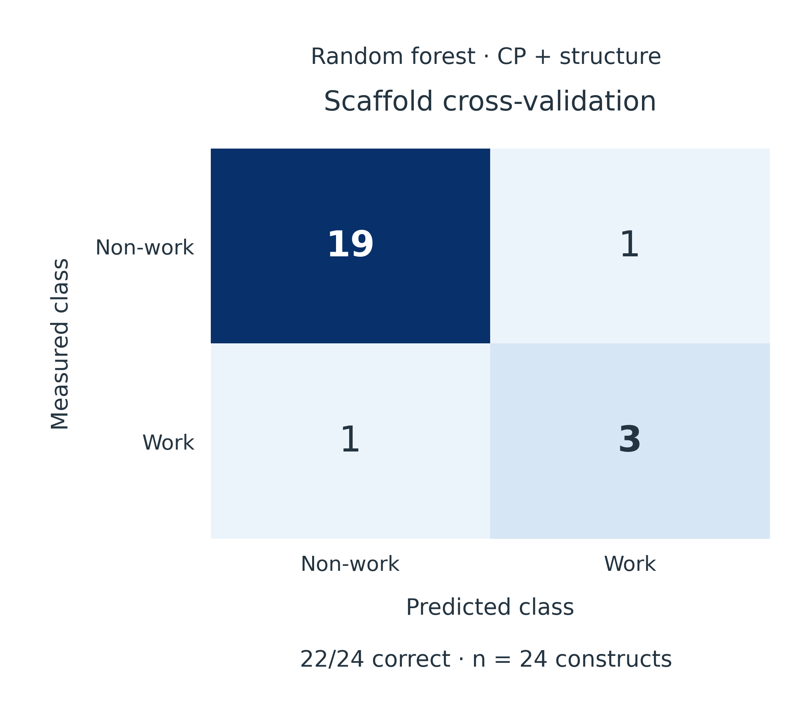
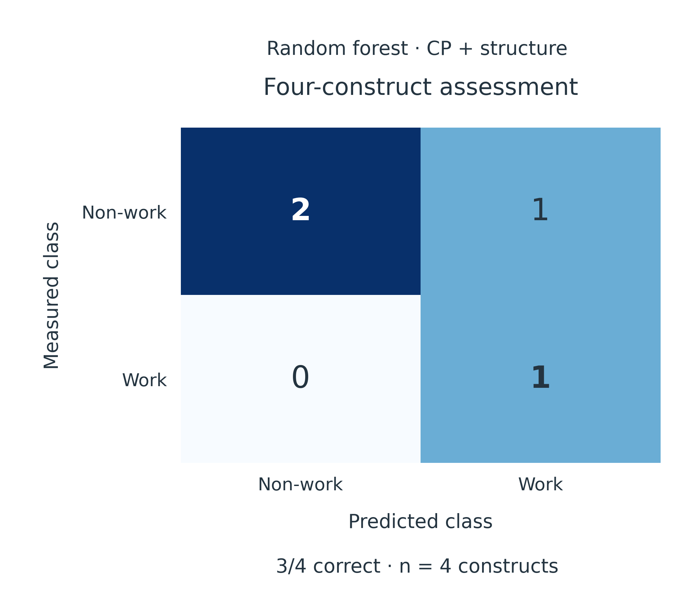

# Model 1.  Selecting functional PUF scaffolds

### Background: repeat rearrangement requires structural support

Changing repeat order or inserting loops can alter the organization of the PUF scaffold. We asked whether protein-internal contacts could distinguish arrangements with different experimental work/non-work outcomes. Here, “work” follows the recorded work/non-work label; C388 editing activity is evaluated separately in Model 2.

### Model explanation: from a decision rule to a shallow tree ensemble

We represented each structure by contact-probability (CP) summaries. For a sequence separation of at least $d$ residues, the density of high-probability contacts was

$$
S_d=\frac{1}{L}\sum_{i<j,\;j-i\geq d}\mathbf{1}(CP_{ij}>0.5),\qquad d\in\{4,12,24\}.
$$

Each residue pair contributes once, and $L$ is the analyzed protein length. A larger value indicates more qualifying contacts per residue. Structure-level features were averaged within seeds and then across seeds, giving one feature vector per construct.

A depth-one decision tree established the initial classification rule. Feature selection was repeated within each training fold and consistently selected S12. We then used shallow ensembles of decision trees to combine contact density with additional structural information.

The three-feature random forest used S4, S12 and S24. Its nine-feature companion added core pLDDT mean and minimum, mean PAE, contact-weighted PAE, normalized radius of gyration and anisotropy. Both used 300 trees, maximum depth two, minimum leaf size two, balanced class weights and random seed 2026. Scores of at least 0.5 produced a work prediction. These scores are uncalibrated classifier outputs.

### Training and held-out performance

The initial decision-tree analysis correctly classified all 14 constructs under leave-one-construct-out evaluation, including three work and eleven non-work cases. The three-feature random forest reproduced this separation. Restricting that evaluation to the twelve PUF12 constructs also retained complete agreement.

After the PUF12 collection was expanded, the nine-feature forest correctly classified 22 of 24 constructs under leave-one-construct-out evaluation. Balanced accuracy was 0.850 and ROC-AUC was 0.913. This expanded evaluation included one false positive and one false negative.

*Figure 1. Scaffold classification under leave-one-construct-out evaluation. Rows show recorded experimental classes and columns show predicted classes. The nine-feature random forest classified 19 non-work and three work constructs correctly; one construct in each class was misclassified. Every plotted prediction excluded that construct from fitting.*

### Experimental comparison: one work and three non-work designs

For the four-design assessment, we trained the nine-feature forest on the remaining twenty constructs and predicted all four excluded designs. We then compared these predictions with their wet-lab labels.

| Construct | Work score | Model prediction | Experimental outcome |
|---|---:|---|---|
| Design 1: R123/R567/R567/R67-no-loop-8 | 0.854 | Work | **Work** |
| Design 3: R123/R567/R56-loop-7/R678 | 0.172 | Non-work | Non-work |
| Design 7: R123/R567/R567/R-loop-67-loop-8 | 0.680 | Work | Non-work |
| Design 8: R123/R567/R567/R6-loop-7-loop-8 | 0.431 | Non-work | Non-work |

The experimental panel contained **one work construct and three non-work constructs**. Predictions agreed with three of the four outcomes. Design 1 received the highest score and received a work outcome in the wet-lab record. Design 7 remained a false positive, showing why scaffold prioritization still requires experimental testing.

*Figure 2. Four-design experimental comparison. All four constructs were excluded simultaneously from the fit. The matrix shows one true positive, two true negatives and one false positive. Predictions come from the nine-feature random forest.*

### What this gives the wet lab

The model provides a structural criterion for prioritizing repeat arrangements and identifies Design 1 as a candidate with a matching recorded work outcome. The false positive motivates checking additional determinants of construct function. Once a functional scaffold is available, the next question concerns its editing profile.

Source records: [scaffold protocol](../../results_20260922/scaffold_RF/audit/protocol.json), [metrics](../../results_20260922/scaffold_RF/results/metrics.csv), [predictions](../../results_20260922/scaffold_RF/results/predictions_indexed.csv) and [historical decision-tree analysis](https://github.com/pdx12320/PUF_alphafold/blob/958de2cc3567671c8f9c452cf819aa2133b630d5/previous/results/PUF_CP_report.md).

## Continue the design cycle

See the [complete three-model Wiki](PUF_Model_EN.md) for TRM editing, non-TRM design, APA references and the integrated engineering cycle. The [earlier detailed module](https://github.com/pdx12320/PUF_alphafold/blob/c38943d46e4e08754a01b3160f53a599505878e4/docs/wiki/PUF_Module1_EN.md) retains additional historical evaluation details.
