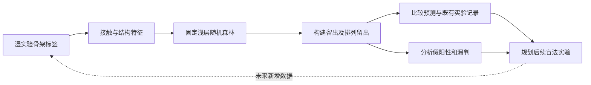

# 第一模块：用接触特征预测 PUF 骨架功能

**工程问题：改变 repeat 排列后，结构接触组织能否帮助判断 PUF 骨架是否具有实验记录中的功能？**

**核心结果：补充训练的浅层随机森林在初始14个构建中完成14/14的留一构建正确分类；去掉两个PUF11后，初始12个PUF12仍为12/12正确。** 扩展第二批骨架后，模型出现假阳性与漏判，提示初始批次的清楚分离需要在更广的设计空间继续验证。

> **证据范围：**本页为针对既有湿实验记录的回顾性计算验证。每个测试构建从其对应模型拟合中排除；数据与历史结果此前已参与方法开发。本次没有新增湿实验。Work沿用骨架的原始标签，与后续TRM按C388活性划分的任务分开。

## 1. 湿实验输入与结构假设

湿实验首先提供14个构建的work/non-work标签：12个PUF12和2个PUF11，共3个成功、11个失败。干实验从预测结构提取接触概率（CP）特征，按model→seed→construct聚合，每个构建作为一个独立标签样本。

历史单层决策树在训练折内选择特征与分割阈值，取得**14/14正确**，14折均选中高概率非局部蛋白接触密度。这项结果是早期发现阶段的证据；本页新增随机森林验证，并分别保留两种模型的结果。[S1]

由此提出结构假设：成功骨架可能维持较完整的蛋白内部接触网络。CP密度与功能标签的关联不能直接证明实验稳定性，也不能确定克隆、表达或编辑过程中的具体失败原因。

## 2. 随机森林如何建立？

主模型采用三个高概率接触密度：

\[
S_d=\frac{1}{L}\sum_{i<j,\;j-i\geq d}\mathbf{1}(CP_{ij}>0.5),\quad d=4,12,24.
\]

其中L为分析蛋白长度，每对残基仅计一次。“非局部”按序列间隔定义；数值是每个残基对应的高概率接触对数量，可以超过1。先在每个结构模型上施加CP阈值，再按既有规则聚合。

**RF-CP3主模型：300棵树、最大深度2、最小叶节点样本数2、sqrt特征抽样、balanced类别权重、随机种子2026。** 填补和标准化仅在训练折拟合，分类分数阈值固定0.5，不根据测试结果修改。

预先设定的**RF-CP＋结构补充模型**再加入核心pLDDT均值/最小值、核心平均PAE、接触加权PAE、长度归一化回转半径和各向异性，共9项特征，森林参数保持相同。[S2] 所有分数均未经过成功概率校准。

## 3. 初始批次：随机森林同样达到全部分类正确

每次完整留出一个构建，只用其余构建训练。相同构建的seed和模型不会跨越训练、测试两侧。

| 数据范围 | 模型 | 正确数 | 成功检出 | 失败排除 | 平衡准确率 |
|---|---|---:|---:|---:|---:|
| 初始14个，含2个PUF11 | 历史单层决策树 | 14/14 | 3/3 | 11/11 | 1.000 |
| **同一初始14构建集合** | **本次RF-CP3** | **14/14** | **3/3** | **11/11** | **1.000** |
| **仅初始12个PUF12** | **本次RF-CP3** | **12/12** | **3/3** | **9/9** | **1.000** |

排除两个较短PUF11后仍全部分类正确，说明初始分离并不依赖这两个样本。另一个预先指定的单S12浅森林敏感性分析也得到14/14。这些结果支持初始数据中存在明确结构信号；特征家族继承了历史探索，因此应称为内部回顾性验证。

[所有本次指标](../../results_20260922/scaffold_RF/results/metrics.csv) · [逐构建预测](../../results_20260922/scaffold_RF/results/predictions_indexed.csv)

## 4. 加入第二批骨架：检验可迁移范围

两批合计24个PUF12，4成功、20失败。第一批为3成功/9失败，第二批为1成功/11失败。保持模型配方与0.5分数界限，分别检验新构建、第二批和未见排列背景。

| 验证方式 | RF-CP3 | RF-CP＋结构 |
|---|---|---|
| 全24个逐构建留出 | 21/24；BA 0.825；AUC 0.913 | **22/24；BA 0.850；AUC 0.913** |
| 第一批12个训练→完整第二批12个 | 8/12；BA 0.818 | **9/12；BA 0.864** |
| 按repeat排列整组留出 | 18/24；BA 0.750；AUC 0.869 | **22/24；BA 0.750；AUC 0.938** |
| 其余20个训练→固定4个留出 | 2/4；BA 0.667 | **3/4；BA 0.833** |

按排列留出时，RF-CP＋结构检出2/4个成功，正确排除20/20个失败。AUC 0.938表示留出分数的区分表现，不能写成93.8%的分类准确率。扩展验证没有复现初始批次的100%，这也是需要保留的学习结果。

### 固定四构建的预测—实验对照

继续使用前一版已经冻结的面板：第二批唯一成功构建，加一次随机抽取的3个失败构建。四个构建同时排除，使用其余20个训练，未根据预测好坏重抽样。

| 第二批构建 | 既有实验标签 | RF-CP3分数／类别 | RF-CP＋结构分数／类别 |
|---|---|---|---|
| **Design 1：R123/R567/R567/R67-no-loop-8** | **Work** | **0.903／Work** | **0.854／Work** |
| Design 3：R123/R567/R56-loop-7/R678 | Non-work | 0.158／Non-work | 0.172／Non-work |
| Design 7：R123/R567/R567/R-loop-67-loop-8 | Non-work | 0.909／Work | 0.680／Work |
| Design 8：R123/R567/R567/R6-loop-7-loop-8 | Non-work | 0.524／Work | 0.431／Non-work |

**Design 1提供了明确的留出一致性案例：干实验预测Work，其未参与拟合的湿实验记录也为Work。** Design 7则是反例，较高的接触密度没有保证功能结果；加入结构摘要纠正了Design 8，但仍未排除Design 7。

## 5. 干实验如何反馈给下一轮设计？



本模块得到可解释的骨架优先级信号，并识别模型无法稳定判断的案例。**初始RF全部分类正确与扩展验证存在错误，两项证据共同界定模型适用范围。** 24个主集骨架仍共享前部R123背景，任意PUF排列的迁移能力尚未验证。骨架功能判断和TRM的三位点编辑优化继续分开建模。

新的前瞻验证需要先冻结候选和预测，再产生新的湿实验结果。当前可以报告的是结构模型与未参与相应拟合的既有记录一致，并为下一轮提供待检验假设。

## 复现与来源

```bash
python results_20260922/scaffold_RF/retrain.py
```

[训练协议](../../results_20260922/scaffold_RF/audit/protocol.json)、[初始CP输入](../../results_20260922/scaffold_RF/data/initial14_CP3.csv)、[扩展输入](../../results_20260922/scaffold_RF/data/scaffolds24.csv)均随结果发布。小型特征表即可重现分类器拟合；完整本地包保留训练权重与划分清单，脚本可重新生成。

[S1] [历史CP报告与单层树记录，固定版本](https://github.com/pdx12320/PUF_alphafold/blob/958de2cc3567671c8f9c452cf819aa2133b630d5/previous/results/PUF_CP_report.md)。

[S2] [扩展骨架特征与验证定义，固定版本](https://github.com/pdx12320/PUF_alphafold/blob/0d68259e15c3d8d26b308bd938ef8acde16083f5/architecture_validation/PUF_architecture_validation_report.md)。
