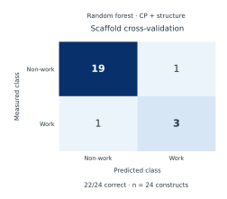
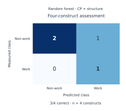
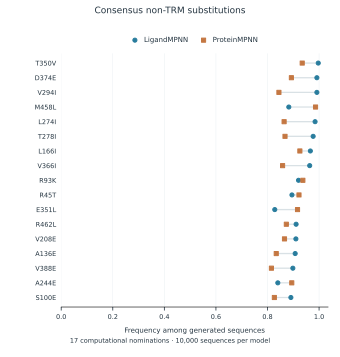

# Quantitative figure captions

The files below are available in SVG, PDF and 600-dpi PNG. CSV source data are in [../figure_data](../figure_data/). The [plotting script](../scripts/make_figures.py) regenerates every figure directly from the recorded repository tables without retraining the models.

## Figure 1

**Fig. 1 | Cross-validation of scaffold classification.** Confusion matrix for `RF_CP_structure9` under leave-one-construct-out (LOCO) cross-validation in the expanded PUF12 scaffold collection. Rows show recorded experimental labels; columns show predictions. Each construct is excluded from its own training fold. The model classifies 22 of 24 constructs correctly, with three true positives, 19 true negatives, one false positive and one false negative. Counts are aggregated across 24 LOCO predictions at a classifier-score threshold of 0.5. This assessment is distinct from the four-construct panel in Fig. 2. No uncertainty estimate or hypothesis test is shown. Source data: `fig2_model1_loco_confusion_predictions.csv` and `fig2_model1_loco_confusion_counts.csv`.

## Figure 2

**Fig. 2 | Classification of the fixed four-construct panel.** Confusion matrix for the random forest using three contact-probability summary features and six structural descriptors (`RF_CP_structure9`). Rows show recorded experimental scaffold labels; columns show predictions at a classifier-score threshold of 0.5. The panel contains one work and three non-work constructs. Three labels are classified correctly: one true positive, two true negatives and one false positive. The four constructs were excluded together from this recorded RF fit. This is the fixed-panel RF assessment; the historical decision stump is a separate analysis. Values are construct counts; no uncertainty estimate or hypothesis test is shown. Source data: `fig1_model1_four_construct_confusion_predictions.csv` and `fig1_model1_four_construct_confusion_counts.csv`.

## Figure 3

**Fig. 3 | Endpoint-specific prediction agreement for five selected constructs.** Confusion matrices for **a**, C295; **b**, C388; and **c**, C871, using five predictions per endpoint. Rows show the measured class and columns the predicted class. The records are the selected five constructs' individually held-out LOCO predictions; the five were not excluded jointly. Class boundaries were selected within each training fold, and their numerical values are retained in the source table. Consequently, “No decrease” denotes failure to cross the selected decrease threshold, and “Within interval” denotes the selected C388 interval. Agreement is 5/5, 4/5 and 4/5 for C295, C388 and C871, respectively. The two errors concern P9-GNS at C388 and P8-GVE at C871. All five C871 measurements have the decrease label, so this panel does not estimate specificity. The aggregate agreement of 13/15 is a descriptive count across correlated endpoint predictions. No uncertainty estimate or hypothesis test is shown. Source data: `model2_selected_five_complete.csv` and `fig3_model2_five_construct_confusion_counts.csv`.

## Figure 4

**Fig. 4 | Non-TRM substitutions supported by both sequence-design models.** Frequencies of the nominated amino acid among 10,000 generated sequences per model at the 17 positions satisfying the recorded consensus rule. Blue circles denote LigandMPNN; orange squares denote ProteinMPNN. The two models nominate the same most frequent amino acid at every displayed position, and all displayed positions are outside the protected TRM set. Mutations use one-based PUF sequence numbering and follow the ranking in the recorded consensus table. Connecting segments link the two model frequencies for the same substitution. These frequencies describe generated-sequence preferences; they do not quantify experimental editing improvements. The candidates remain computational nominations. No inferential uncertainty or hypothesis test is shown. Source data: `fig5_model3_nontrm_consensus.csv`.

