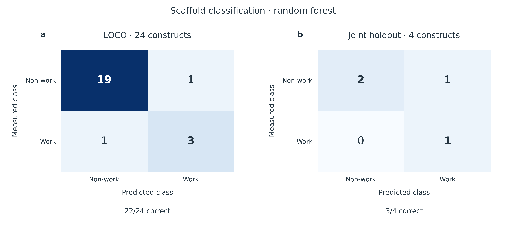
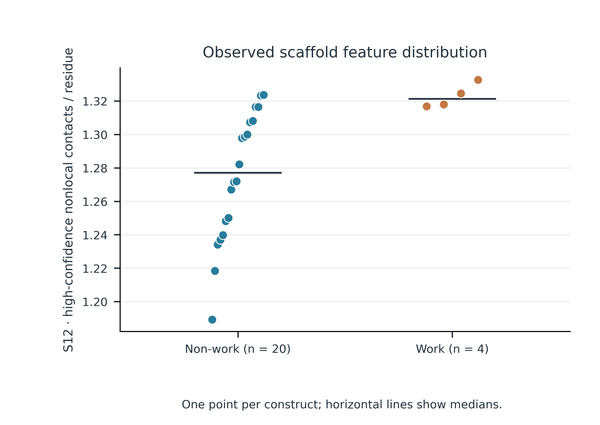
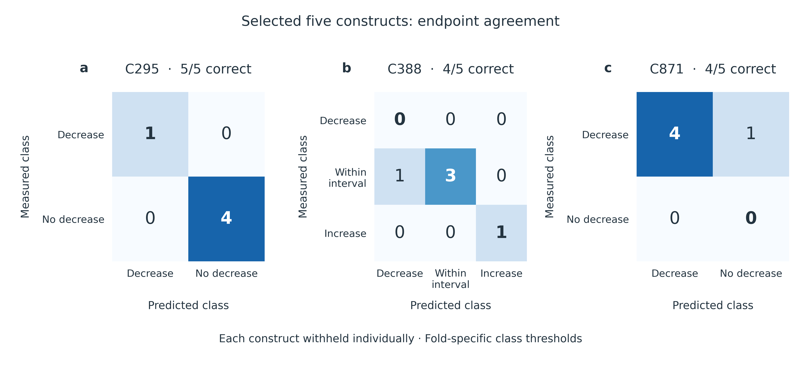

# From PUF scaffold selection to selective RNA editing

## Background and engineering objective

PUF proteins recognize RNA through an array of repeats, each contributing a small set of base-recognition residues (Wang et al., 2002). These residues can be redesigned to change RNA sequence preference (Cheong & Hall, 2006). Repeat expansion also changes the architecture and binding properties of the RNA-binding domain (Zhao et al., 2018).

Our PUF–APOBEC system couples this programmable recognition scaffold to RNA editing. The engineering objective is to retain editing at the reporter target, C388, while reducing editing at the reporter bystander sites, C295 and C871. This requires decisions at three levels: repeat arrangement, recognition motifs and the surrounding protein sequence. AlphaFold 3 predictions provided structural inputs for contact analysis and sequence design (Abramson et al., 2024).

| Model | Biological question | Computational output | Wet-lab connection |
|---|---|---|---|
| **1. Scaffold function** | Which repeat arrangements support a functional PUF scaffold? | Work/non-work classification from protein contacts | Four-design comparison with one work and three non-work outcomes |
| **2. TRM-dependent editing** | Which recognition-motif changes retain target editing and reduce bystander editing? | Separate predictions for C295, C388 and C871 | Five experimentally characterized constructs with complementary editing profiles |
| **3. Non-TRM design** | Which surrounding residues should be tested on favourable TRM backgrounds? | Inverse-folding nominations and mutation combinations | Non-TRM mutation candidates for experimental testing |

The sections follow **background → model → evaluation → experimental comparison → design consequence**. The comparisons use construct-held-out predictions and existing experimental records. They describe retrospective validation; Model 3 adds computational proposals for a subsequent wet-lab round.

## Model 1. Contact-based scaffold screening

### Why repeat arrangement matters

Changing repeat order or inserting loops can alter the organization of the PUF scaffold. We asked whether protein-internal contacts could distinguish arrangements with different experimental work/non-work outcomes. Here, “work” follows the recorded work/non-work label; C388 editing activity is evaluated separately in Model 2.

### Learning a structural decision rule

We represented each structure by contact-probability (CP) summaries. For a sequence separation of at least $d$ residues, the density of high-probability contacts was

$$
S_d=\frac{1}{L}\sum_{i<j,\;j-i\geq d}\mathbf{1}(CP_{ij}>0.5),\qquad d\in\{4,12,24\}.
$$

Each residue pair contributes once, and $L$ is the analyzed protein length. A larger value indicates more qualifying contacts per residue. Structure-level features were averaged within seeds and then across seeds, giving one feature vector per construct.

A depth-one decision tree established the initial classification rule. Feature selection was repeated within each training fold and consistently selected S12. We then used shallow ensembles of decision trees to combine contact density with additional structural information.

The three-feature random forest used S4, S12 and S24. Its nine-feature companion added core pLDDT mean and minimum, mean PAE, contact-weighted PAE, normalized radius of gyration and anisotropy. Both used 300 trees, maximum depth two, minimum leaf size two, balanced class weights and random seed 2026. Scores of at least 0.5 produced a work prediction. These scores are uncalibrated classifier outputs.

### From the initial rule to expanded scaffold evaluation

The initial decision-tree analysis correctly classified all 14 constructs under leave-one-construct-out evaluation, including three work and eleven non-work cases. The three-feature random forest reproduced this separation. Restricting that evaluation to the twelve PUF12 constructs also retained complete agreement.

After the PUF12 collection was expanded, the nine-feature forest correctly classified 22 of 24 constructs under leave-one-construct-out evaluation. Balanced accuracy was 0.850 and ROC-AUC was 0.913. This expanded evaluation included one false positive and one false negative.

### Experimental comparison: one work and three non-work designs

For the four-design assessment, we trained the nine-feature forest on the remaining twenty constructs and predicted all four excluded designs. We then compared these predictions with their wet-lab labels.

| Construct | Work score | Model prediction | Experimental outcome |
|---|---:|---|---|
| Design 1: R123/R567/R567/R67-no-loop-8 | 0.854 | Work | **Work** |
| Design 3: R123/R567/R56-loop-7/R678 | 0.172 | Non-work | Non-work |
| Design 7: R123/R567/R567/R-loop-67-loop-8 | 0.680 | Work | Non-work |
| Design 8: R123/R567/R567/R6-loop-7-loop-8 | 0.431 | Non-work | Non-work |

The experimental panel contained **one work construct and three non-work constructs**. Predictions agreed with three of the four outcomes. Design 1 received the highest score and received a work outcome in the wet-lab record. Design 7 remained a false positive, showing why scaffold prioritization still requires experimental testing.

*Figure 1. Scaffold classification in two recorded evaluations. (a) Leave-one-construct-out (LOCO) evaluation in the expanded collection: 22/24 correct. (b) Four constructs withheld jointly: 3/4 correct, comprising one true positive, two true negatives and one false positive. Rows are measured classes and columns are predictions of the nine-feature random forest at a score threshold of 0.5. Both panels use the same colour scale for counts. The historical decision stump is a separate analysis.*

*Figure 2. Observed S12 distribution across the expanded scaffold collection. Each point represents one construct (20 non-work; four work); horizontal lines indicate medians. S12 is the per-residue high-confidence nonlocal contact feature, pp_nonlocal12_high_per_res. Horizontal offsets separate observations and have no quantitative meaning. The overlapping distributions are descriptive and do not establish a universal decision threshold.*

### Scaffold selection for experimental testing

The model provides a structural criterion for prioritizing repeat arrangements and identifies Design 1 as a candidate with a matching recorded work outcome. The false positive motivates checking additional determinants of construct function. Once a functional scaffold is available, the next question concerns its editing profile.

Source records: [scaffold protocol](../research/results_20260922/scaffold_RF/audit/protocol.json), [metrics](../research/results_20260922/scaffold_RF/results/metrics.csv), [predictions](../research/results_20260922/scaffold_RF/results/predictions_indexed.csv) and [historical decision-tree analysis](https://github.com/pdx12320/PUF_alphafold/blob/958de2cc3567671c8f9c452cf819aa2133b630d5/previous/results/PUF_CP_report.md).

## Model 2. Balancing target and bystander editing

### Defining the three-site editing objective

The tripartite recognition motif (TRM) defines a repeat's base-recognition code. Changing this motif can produce different effects at the target and the two bystander sites. We modeled all three editing endpoints separately and compared each variant with its matched experimental control.

For site $s$, the editing change was

$$
\Delta E_s=100\left(E_{s,\mathrm{variant}}-E_{s,\mathrm{control}}\right),
$$

where editing fractions lie between zero and one. Changes are reported in percentage points (pp). Negative C295 or C871 changes indicate lower bystander editing; C388 changes quantify target-activity retention or improvement.

### Learning endpoint-specific contact patterns

The workflow used protein–RNA contact changes as structural inputs, including local, distal, full-matrix and reference-interface feature sets. The selected classifier and feature family could differ between endpoints and training folds. Saved selections included regularized linear models, support-vector methods, discriminant analysis and tree ensembles.

For C295 and C871, the classifier distinguished a reduction beyond the selected threshold from smaller changes. C388 used three classes: decrease, within the selected interval and increase. Thresholds were selected in the training workflow and are recorded for every held-out prediction. Consequently, the labels describe fold-specific biological boundaries.

The evaluation withheld each construct in turn, fitted the workflow using the remaining constructs and predicted the omitted construct. A construct's own editing outcome was excluded from its corresponding fit. Variants at the same repeat position could remain in training.

### Cross-validation and the five-candidate comparison

The complete combined protein–RNA evaluation provides the context for reading the five highlighted candidates.

| Endpoint | Correct held-out predictions | Balanced accuracy | Matched baseline balanced accuracy |
|---|---:|---:|---:|
| C295 | 57/81 | 0.703 | 0.519 |
| C388, three classes | 36/81 | 0.433 | 0.399 |
| C871 | 49/81 | 0.610 | 0.687 |

Performance varied by endpoint, and the C871 model did not exceed the matched baseline in this evaluation. The selected five-construct comparison therefore serves as a detailed case study of useful experimental profiles. These constructs were selected for presentation based on their experimental outcomes.

Across those five constructs, predicted and experimental classes agreed at **13 of 15 endpoints**: five of five for C295, four of five for C388 and four of five for C871. The disagreements were C388 for P9-GNS and C871 for P8-GVE.

*Figure 3. Endpoint-level confusion matrices for the same five constructs. Agreement is 5/5 at C295, 4/5 at C388 and 4/5 at C871. All five C871 measurements belong to the decrease class, so C871 specificity cannot be estimated from this panel. Each construct was withheld individually; class thresholds are fold-specific.*

## Model 3. Exploring non-TRM sequence space with AiCE

### Extending design beyond RNA recognition

Models 1 and 2 established a route from scaffold selection to experimentally useful TRM backgrounds. We next examined substitutions outside the recognition code. Such substitutions offer testable hypotheses about scaffold organization and the protein–RNA interface while preserving the chosen TRMs.

We adapted the AiCE framework, AI-informed constraints for protein engineering, to structure-conditioned sequence sampling (Fei et al., 2025). This module applies pretrained inverse-folding models to nominate mutations. The PUF editing measurements guide background selection and interpretation.

### The inverse-folding workflow

| Step | Input and operation | Output |
|---|---|---|
| **1. Define the structural reference** | Use the predicted 493-residue PUF12 complex with a 17-nt APOE4 RNA segment; map repeats and recognition positions | A shared protein reference and explicit residue numbering |
| **2. Sample compatible sequences** | Generate 10,000 sequences per model at temperature 0.5 | ProteinMPNN and LigandMPNN sequence ensembles |
| **3. Scan every position** | Count WT and alternative amino-acid frequencies across all 493 positions | Position-specific sequence preferences |
| **4. Protect the recognition code** | Apply the configured recognition-position filter after sampling and retain supported non-TRM changes | 81 nominated positions, including 17 same-substitution dual-model nominations |
| **5. Combine with experimental backgrounds** | Add selected non-TRM substitutions to P8-GVE, P9-NTQ or P7-SYVIRR | Background-specific mutation proposals |
| **6. Return to the wet lab** | Compare candidates with their backgrounds using C295, C388 and C871 measurements | A direct test of the proposed substitutions |

ProteinMPNN conditions sequence generation on the protein backbone (Dauparas et al., 2022). LigandMPNN additionally uses the surrounding atomic context, including RNA atoms (Dauparas et al., 2025). Both use the same structural reference, with different conditioning information.

Sampling covered the protein sequence without fixing TRM positions during generation. Recognition positions were protected during candidate filtering and construction of the final sequences. For this run, the implemented frequency filter used a threshold of 0.8; all exported positions had the flexible-region flag set to false. No task-specific retraining of either MPNN model was performed.

### Seventeen consensus substitutions

The screen identified **17 substitutions supported by both inverse-folding models**. Both models favoured the same alternative amino acid at these positions. The table separates substitutions used in the proposed core set from further consensus candidates.

| Design use | Exact substitutions | Interpretation |
|---|---|---|
| Consensus set used in the proposed core combinations | **T350V, D374E, M458L, L274I, T278I, V366I** | Test a combined change to the surrounding scaffold |
| N-terminal-region candidate | **R45T** | Test an additional change near the fusion-end region |
| Further dual-model nominations | **V294I, L166I, R93K, E351L, R462L, V208E, A136E, V388E, A244E, S100E** | Extend the candidate pool with single-mutant comparisons |
| Additional interface proposals | A438G, H392D | Supported by one model at the stated threshold |
| Additional N-terminal proposals | S30A, L41R; N12S as an exploratory design choice | Included in geometry combinations; N12S has the nomination-label discrepancy described below |

*Figure 4. Sampling frequencies for the exact 17 consensus substitutions. Each value is the fraction of 10,000 generated sequences carrying the indicated residue in one model. Frequency describes structural sequence preference and does not estimate the probability of improved RNA editing.*

The broader 81-position export requires an additional identity check. At N12, the ProteinMPNN frequency above the threshold supports **N12G**, while the proposed construct contains **N12S**. We retain N12S as an exploratory design choice and document the discrepancy in the [Model 3 methods page](../research/aice_mpnn_20260922/README.md). Neither substitution has a measured editing benefit in this release.

Residue numbers refer to the full **493-residue reference protein**. N12 identifies its twelfth residue; TRM positions 12, 13 and 16 refer to positions within a repeat. Numbering should be mapped explicitly when using constructs with different terminal sequences.

## Integration into the engineering cycle

The three models address successive design decisions. Scaffold modeling prioritizes repeat arrangements, TRM analysis identifies useful experimental editing profiles, and inverse folding proposes changes around those recognition motifs. The resulting wet-lab handoff contains named backgrounds, exact substitutions and three measurable editing endpoints.

The experimental records support the work prediction for Design 1 and reveal complementary editing profiles among the five TRM constructs. The non-TRM candidates extend this evidence into a testable next round. Their results can refine the choice of individual substitutions and combinations.

## Data, figures and reproducibility

GitHub repository: [pdx12320/PUF_alphafold](https://github.com/pdx12320/PUF_alphafold).

All quantitative displays were regenerated from archived prediction and measurement tables. No wet-lab values, model predictions or labels were changed during this revision. Confusion matrices use held-out predictions and retain every error within the displayed panels.

The [figure script](scripts/make_figures.py), [figure source data](figure_data) and [vector exports](figures) accompany this page. The [results index](../research/results_20260922/README.md) distinguishes the scaffold, five-construct, ten-construct and full-cohort evaluation protocols. Historical analyses remain available through the [engineering record](../research/docs/DRY_LAB_DBTL.md).

## References

Abramson, J., Adler, J., Dunger, J., Evans, R., Green, T., Pritzel, A., Ronneberger, O., Willmore, L., Ballard, A. J., Bambrick, J., Bodenstein, S. W., Evans, D. A., Hung, C.-C., O’Neill, M., Reiman, D., Tunyasuvunakool, K., Wu, Z., Žemgulytė, A., Arvaniti, E., … Jumper, J. M. (2024). Accurate structure prediction of biomolecular interactions with AlphaFold 3. *Nature, 630*(8016), 493–500. https://doi.org/10.1038/s41586-024-07487-w

Cheong, C.-G., & Hall, T. M. T. (2006). Engineering RNA sequence specificity of Pumilio repeats. *Proceedings of the National Academy of Sciences, 103*(37), 13635–13639. https://doi.org/10.1073/pnas.0606294103

Dauparas, J., Anishchenko, I., Bennett, N., Bai, H., Ragotte, R. J., Milles, L. F., Wicky, B. I. M., Courbet, A., de Haas, R. J., Bethel, N., Leung, P. J. Y., Huddy, T. F., Pellock, S., Tischer, D., Chan, F., Koepnick, B., Nguyen, H., Kang, A., Sankaran, B., … Baker, D. (2022). Robust deep learning–based protein sequence design using ProteinMPNN. *Science, 378*(6615), 49–56. https://doi.org/10.1126/science.add2187

Dauparas, J., Lee, G. R., Pecoraro, R., An, L., Anishchenko, I., Glasscock, C., & Baker, D. (2025). Atomic context-conditioned protein sequence design using LigandMPNN. *Nature Methods, 22*(4), 717–723. https://doi.org/10.1038/s41592-025-02626-1

Fei, H., Li, Y., Liu, Y., Wei, J., Chen, A., & Gao, C. (2025). Advancing protein evolution with inverse folding models integrating structural and evolutionary constraints. *Cell, 188*(17), 4674–4692.e19. https://doi.org/10.1016/j.cell.2025.06.014

Wang, X., McLachlan, J., Zamore, P. D., & Hall, T. M. T. (2002). Modular recognition of RNA by a human Pumilio-homology domain. *Cell, 110*(4), 501–512. https://doi.org/10.1016/S0092-8674(02)00873-5

Zhao, Y.-Y., Mao, M.-W., Zhang, W.-J., Wang, J., Li, H.-T., Yang, Y., Wang, Z., & Wu, J.-W. (2018). Expanding RNA binding specificity and affinity of engineered PUF domains. *Nucleic Acids Research, 46*(9), 4771–4782. https://doi.org/10.1093/nar/gky134
