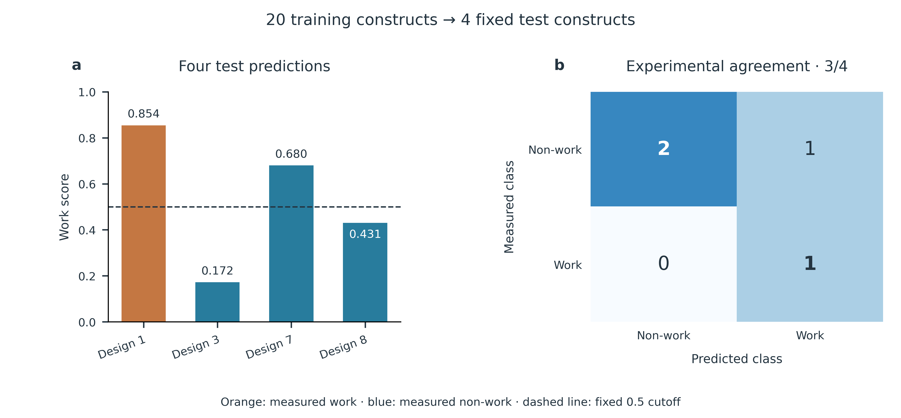
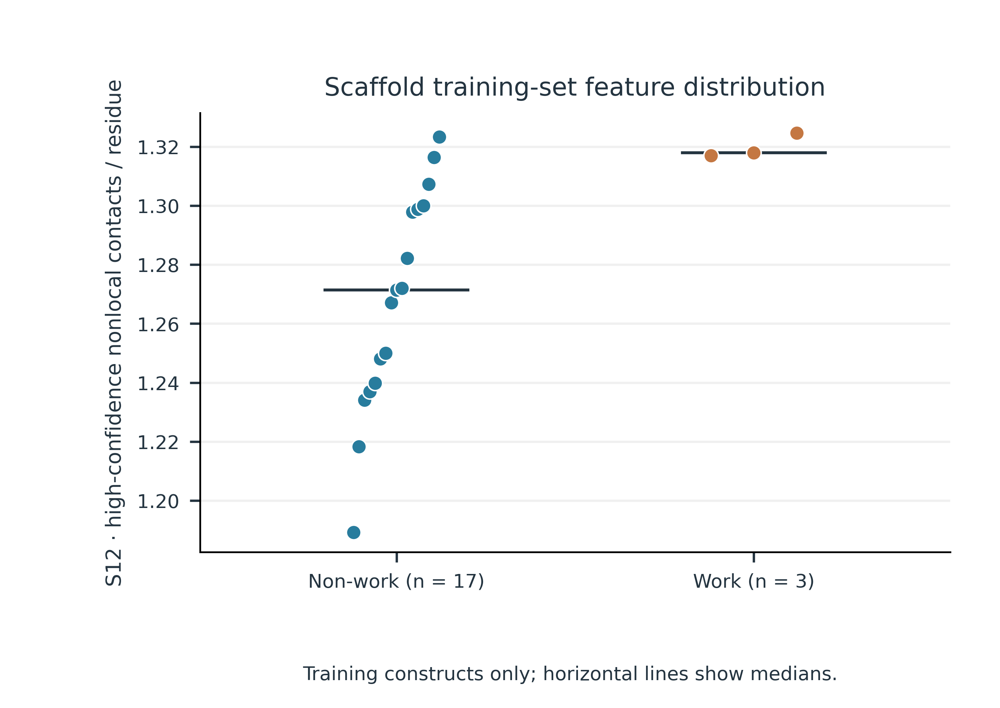
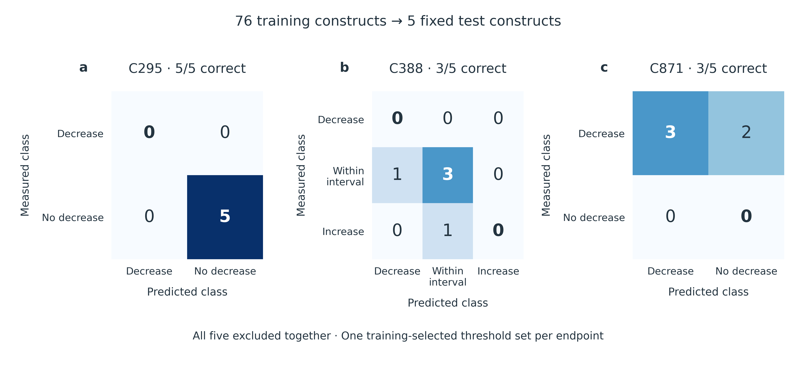
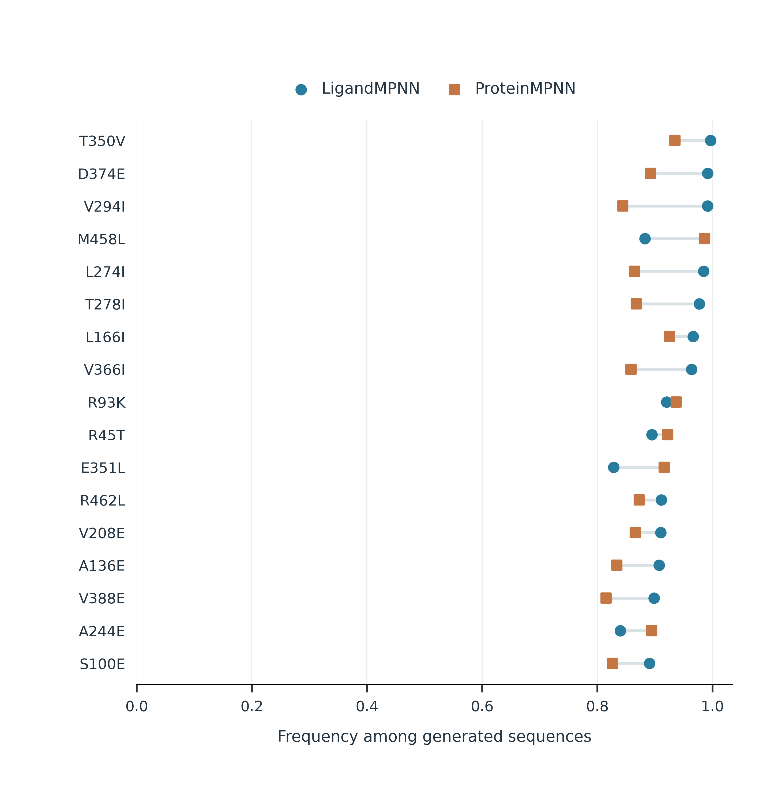

# From PUF scaffold selection to selective RNA editing

## Background and engineering objective

PUF proteins recognize RNA through an array of repeats, each contributing a small set of base-recognition residues (Wang et al., 2002). These residues can be redesigned to change RNA sequence preference (Cheong & Hall, 2006). Repeat expansion also changes the architecture and binding properties of the RNA-binding domain (Zhao et al., 2018).

Our PUF–APOBEC system couples this programmable recognition scaffold to RNA editing. The engineering objective is to retain editing at the reporter target, C388, while reducing editing at the reporter bystander sites, C295 and C871. This requires decisions at three levels: repeat arrangement, recognition motifs and the surrounding protein sequence. AlphaFold 3 predictions provided structural inputs for contact analysis and sequence design (Abramson et al., 2024).

| Model | Biological question | Computational output | Wet-lab connection |
|---|---|---|---|
| **1. Scaffold function** | Which repeat arrangements support a functional PUF scaffold? | Work/non-work classification from protein contacts | Four-design comparison with one work and three non-work outcomes |
| **2. TRM-dependent editing** | Which recognition-motif changes retain target editing and reduce bystander editing? | Separate predictions for C295, C388 and C871 | Five experimentally characterized constructs with complementary editing profiles |
| **3. Non-TRM design** | Which surrounding residues should be tested on favourable TRM backgrounds? | Inverse-folding nominations and mutation combinations | Non-TRM mutation candidates for experimental testing |

The project workflow follows **training → candidate prediction → subsequent wet-lab testing → design refinement**. Four scaffold designs and five TRM variants form fixed test panels for Models 1 and 2, respectively. Every member of each panel is excluded together from its model’s training and model-selection steps. Model 3 proposes non-TRM substitutions for the next experimental round.

## Model 1. Contact-based scaffold screening

### Why repeat arrangement matters

Changing repeat order or inserting loops can alter the organization of the PUF scaffold. We asked whether protein-internal contacts could distinguish arrangements with different experimental work/non-work outcomes. Here, “work” follows the recorded work/non-work label; C388 editing activity is evaluated separately in Model 2.

### Learning a structural decision rule

We represented each structure by contact-probability (CP) summaries. For a sequence separation of at least $d$ residues, the density of high-probability contacts was

$$
S_d=\frac{1}{L}\sum_{i<j,\;j-i\geq d}\mathbf{1}(CP_{ij}>0.5),\qquad d\in\{4,12,24\}.
$$

Each residue pair contributes once, and $L$ is the analyzed protein length. A larger value indicates more qualifying contacts per residue. Structure-level features were averaged within seeds and then across seeds, giving one feature vector per construct.

A depth-one decision tree established the initial classification rule. Feature selection was repeated within each training fold and consistently selected S12. We then used shallow ensembles of decision trees to combine contact density with additional structural information.

The three-feature random forest used S4, S12 and S24. Its nine-feature companion added core pLDDT mean and minimum, mean PAE, contact-weighted PAE, normalized radius of gyration and anisotropy. Both used 300 trees, maximum depth two, minimum leaf size two, balanced class weights and random seed 2026. Scores of at least 0.5 produced a work prediction. These scores are uncalibrated classifier outputs.

### Training with a separate four-design test panel

The four test designs were set aside before fitting. We trained the nine-feature random forest on the remaining twenty scaffold constructs. Missing-value handling, feature scaling and model fitting used only those training records. The forest recipe and 0.5 classification cutoff were fixed; none was selected using the four test outcomes.

The earlier decision-tree analysis motivated contact-based screening. Its cross-validation results are retained in the research archive. The result displayed here is the fixed four-design test.

### Experimental comparison: one work and three non-work designs

The four designs advanced to wet-lab testing after prediction in the project workflow. The reproducible fixed-test analysis predicts all four with one model fitted to the twenty training constructs, then compares their predictions with the experimental work/non-work outcomes.

| Construct | Work score | Model prediction | Experimental outcome |
|---|---:|---|---|
| Design 1: R123/R567/R567/R67-no-loop-8 | 0.854 | Work | **Work** |
| Design 3: R123/R567/R56-loop-7/R678 | 0.172 | Non-work | Non-work |
| Design 7: R123/R567/R567/R-loop-67-loop-8 | 0.680 | Work | Non-work |
| Design 8: R123/R567/R567/R6-loop-7-loop-8 | 0.431 | Non-work | Non-work |

The experimental panel contained **one work construct and three non-work constructs**. Predictions agreed with three of the four outcomes. Design 1 received the highest score and received a work outcome in the wet-lab record. Design 7 remained a false positive, showing why scaffold prioritization still requires experimental testing.

*Figure 1. Four scaffold designs evaluated as one fixed test panel. (a) Work scores from the model fitted to twenty separate training constructs; the dashed line marks the fixed 0.5 cutoff. Colours show the subsequently measured class. (b) Comparison with experimental labels: one true positive, two true negatives and one false positive. All four designs were excluded together from preprocessing and fitting.*

*Figure 2. S12 distribution in the twenty-construct training set: seventeen non-work and three work constructs. Each point represents one training construct; horizontal lines show medians. The four test designs are absent. S12 denotes high-confidence nonlocal contacts per residue; horizontal offsets only separate points.*

### Scaffold selection for experimental testing

The model provides a structural criterion for prioritizing repeat arrangements and identifies Design 1 as a candidate with a matching recorded work outcome. The false positive motivates checking additional determinants of construct function. Once a functional scaffold is available, the next question concerns its editing profile.

Current fixed-test records: [train/test split](../research/fixed_test_20260923/model1/split.json) and [four test predictions](../research/fixed_test_20260923/model1/predictions.csv).

Earlier development records: [scaffold protocol](../research/results_20260922/scaffold_RF/audit/protocol.json), [metrics](../research/results_20260922/scaffold_RF/results/metrics.csv), [predictions](../research/results_20260922/scaffold_RF/results/predictions_indexed.csv) and [historical decision-tree analysis](https://github.com/pdx12320/PUF_alphafold/blob/958de2cc3567671c8f9c452cf819aa2133b630d5/previous/results/PUF_CP_report.md).

## Model 2. Balancing target and bystander editing

### Defining the three-site editing objective

The tripartite recognition motif (TRM) defines a repeat's base-recognition code. Changing this motif can produce different effects at the target and the two bystander sites. We modeled all three editing endpoints separately and compared each variant with its matched experimental control.

For site $s$, the editing change was

$$
\Delta E_s=100\left(E_{s,\mathrm{variant}}-E_{s,\mathrm{control}}\right),
$$

where editing fractions lie between zero and one. Changes are reported in percentage points (pp). Negative C295 or C871 changes indicate lower bystander editing; C388 changes quantify target-activity retention or improvement.

### Training with five candidates reserved for testing

The test panel comprises **P9-GNS, P9-NPS, P9-NTQ, P8-GVE and P4-R5-SNE+P7-R5-SNE**. All five constructs, together with any identical-sequence records, are excluded before training. The remaining **76 constructs** supply the training data. Each endpoint has one final classifier, fitted without any of the five test outcomes.

Protein–RNA contact representations include full-matrix, local, distal and reference-interface features. Representation selection, preprocessing, classifier selection and biological threshold selection are performed using grouped internal cross-validation within the 76 training constructs. These internal validation splits contain no member of the five-construct test panel. The final selected model is then fitted to all 76 training constructs and predicts the five test constructs together.

For reproducibility, the test outcome fields were masked throughout the new training run. Predictions were saved before the outcomes were reintroduced for scoring. One training-selected set of class boundaries applies to all five test constructs at each endpoint.

| Endpoint | Training-selected representation | Final classifier | Fixed experimental class boundaries |
|---|---|---|---|
| C295 | full_PR | RF | Decrease: ΔE ≤ −15 pp; otherwise no decrease |
| C388 | full_PR | LinearSVM | Decrease: ΔE ≤ −12.5 pp; interval: −12.5 < ΔE < +2.5 pp; increase: ΔE ≥ +2.5 pp |
| C871 | full_PR | Ridge | Decrease: ΔE ≤ −7.5 pp; otherwise no decrease |

### Subsequent wet-lab testing and prediction agreement

The five candidates were tested experimentally after prediction in the project workflow. The fixed-panel reconstruction compares one set of predictions with their measured C295, C388 and C871 editing outcomes. Agreement is **11/15 endpoint calls**: **5/5 at C295, 3/5 at C388 and 3/5 at C871**.

| Endpoint | Correct test predictions | Majority-class reference from training |
|---|---:|---:|
| C295 | 5/5 | 5/5 |
| C388 | 3/5 | 0/5 |
| C871 | 3/5 | 5/5 |

For C388, the model predicts the selected interval correctly for P9-GNS, P9-NPS and P9-NTQ. It predicts a decrease for P8-GVE, whose measured change falls within the interval, and predicts the interval for P4-R5-SNE+P7-R5-SNE, whose editing increases. For C871, the missed decreases occur in P9-NPS and the P4/P7 dual variant.

All five C295 measurements fall in the no-decrease class under the training-selected −15 pp boundary, and all five C871 measurements fall in the decrease class under the −7.5 pp boundary. These small single-class panels support an exact agreement count; they do not characterize both classes equally. The majority-class reference provides context for the endpoint-specific results.

*Figure 3. Endpoint predictions for the fixed five-construct test panel. All five constructs were excluded together from every fitting and selection step. The same endpoint-specific classifier and class boundaries apply to every test construct. Matrices show 5/5, 3/5 and 3/5 agreement for C295, C388 and C871, respectively. Rows are measured classes and columns are predictions.*

### Experimental feedback for the next design

The measured editing profiles identify backgrounds for subsequent non-TRM engineering. Prediction errors identify endpoint behaviours to address in the next model iteration. The five test outcomes remain separate from this fitted model; using them in a future update would require a new independent test set.

Source records: [fixed-panel protocol and reconstruction](../research/fixed_test_20260923/README.md), [all fifteen test predictions](../research/fixed_test_20260923/model2/predictions.csv), and endpoint-specific training splits and selected models in the [result directory](../research/fixed_test_20260923/model2/). Earlier individual-construct cross-validation outputs are retained in the archive and are not used for the test metrics shown here.

## Model 3. Exploring non-TRM sequence space with AiCE

### Extending design beyond RNA recognition

Models 1 and 2 established a route from scaffold selection to experimentally useful TRM backgrounds. We next examined substitutions outside the recognition code. Such substitutions offer testable hypotheses about scaffold organization and the protein–RNA interface while preserving the chosen TRMs.

We adapted the AiCE framework, AI-informed constraints for protein engineering, to structure-conditioned sequence sampling (Fei et al., 2025). This module applies pretrained inverse-folding models to nominate mutations. The PUF editing measurements guide background selection and interpretation.

### The inverse-folding workflow

| Step | Input and operation | Output |
|---|---|---|
| **1. Define the structural reference** | Use the predicted 493-residue PUF12 complex with a 17-nt APOE4 RNA segment; map repeats and recognition positions | A shared protein reference and explicit residue numbering |
| **2. Sample compatible sequences** | Generate 10,000 sequences per model at temperature 0.5 | ProteinMPNN and LigandMPNN sequence ensembles |
| **3. Scan every position** | Count WT and alternative amino-acid frequencies across all 493 positions | Position-specific sequence preferences |
| **4. Protect the recognition code** | Apply the configured recognition-position filter after sampling and retain supported non-TRM changes | 81 nominated positions, including 17 same-substitution dual-model nominations |
| **5. Combine with experimental backgrounds** | Add selected non-TRM substitutions to P8-GVE, P9-NTQ or P7-SYVIRR | Background-specific mutation proposals |
| **6. Return to the wet lab** | Compare candidates with their backgrounds using C295, C388 and C871 measurements | A direct test of the proposed substitutions |

ProteinMPNN conditions sequence generation on the protein backbone (Dauparas et al., 2022). LigandMPNN additionally uses the surrounding atomic context, including RNA atoms (Dauparas et al., 2025). Both use the same structural reference, with different conditioning information.

Sampling covered the protein sequence without fixing TRM positions during generation. Recognition positions were protected during candidate filtering and construction of the final sequences. For this run, the implemented frequency filter used a threshold of 0.8; all exported positions had the flexible-region flag set to false. No task-specific retraining of either MPNN model was performed.

### Seventeen consensus substitutions

The screen identified **17 substitutions supported by both inverse-folding models**. Both models favoured the same alternative amino acid at these positions. The table separates substitutions used in the proposed core set from further consensus candidates.

| Design use | Exact substitutions | Interpretation |
|---|---|---|
| Consensus set used in the proposed core combinations | **T350V, D374E, M458L, L274I, T278I, V366I** | Test a combined change to the surrounding scaffold |
| N-terminal-region candidate | **R45T** | Test an additional change near the fusion-end region |
| Further dual-model nominations | **V294I, L166I, R93K, E351L, R462L, V208E, A136E, V388E, A244E, S100E** | Extend the candidate pool with single-mutant comparisons |
| Additional interface proposals | A438G, H392D | Supported by one model at the stated threshold |
| Additional N-terminal proposals | S30A, L41R; N12S as an exploratory design choice | Included in geometry combinations; N12S has the nomination-label discrepancy described below |

*Figure 4. Sampling frequencies for the exact 17 consensus substitutions. Each value is the fraction of 10,000 generated sequences carrying the indicated residue in one model. Frequency describes structural sequence preference and does not estimate the probability of improved RNA editing.*

The broader 81-position export requires an additional identity check. At N12, the ProteinMPNN frequency above the threshold supports **N12G**, while the proposed construct contains **N12S**. We retain N12S as an exploratory design choice and document the discrepancy in the [Model 3 methods page](../research/aice_mpnn_20260922/README.md). Neither substitution has a measured editing benefit in this release.

Residue numbers refer to the full **493-residue reference protein**. N12 identifies its twelfth residue; TRM positions 12, 13 and 16 refer to positions within a repeat. Numbering should be mapped explicitly when using constructs with different terminal sequences.

## Integration into the engineering cycle

The three models address successive design decisions. Scaffold modeling prioritizes repeat arrangements, TRM analysis identifies useful experimental editing profiles, and inverse folding proposes changes around those recognition motifs. The resulting wet-lab handoff contains named backgrounds, exact substitutions and three measurable editing endpoints.

The experimental records support the work prediction for Design 1 and reveal complementary editing profiles among the five TRM constructs. The non-TRM candidates extend this evidence into a testable next round. Their results can refine the choice of individual substitutions and combinations.

## Data, figures and reproducibility

GitHub repository: [pdx12320/PUF_alphafold](https://github.com/pdx12320/PUF_alphafold).

Models 1 and 2 were rerun with fixed test membership, and the displayed test predictions come from those runs. Original wet-lab values were preserved. Model 2 class boundaries were selected using training data only, so its test classes follow the newly selected common endpoint thresholds. Confusion matrices use the fixed-panel predictions and retain every error within the displayed panels.

The [fixed-test figure script](scripts/make_fixed_test_figures.py) and [non-TRM figure script](scripts/make_figures.py), [figure source data](figure_data) and [vector exports](figures) accompany this page. The [results index](../research/results_20260922/README.md) distinguishes the scaffold, five-construct, ten-construct and full-cohort evaluation protocols. Historical analyses remain available through the [engineering record](../research/docs/DRY_LAB_DBTL.md).

## References

Abramson, J., Adler, J., Dunger, J., Evans, R., Green, T., Pritzel, A., Ronneberger, O., Willmore, L., Ballard, A. J., Bambrick, J., Bodenstein, S. W., Evans, D. A., Hung, C.-C., O’Neill, M., Reiman, D., Tunyasuvunakool, K., Wu, Z., Žemgulytė, A., Arvaniti, E., … Jumper, J. M. (2024). Accurate structure prediction of biomolecular interactions with AlphaFold 3. *Nature, 630*(8016), 493–500. https://doi.org/10.1038/s41586-024-07487-w

Cheong, C.-G., & Hall, T. M. T. (2006). Engineering RNA sequence specificity of Pumilio repeats. *Proceedings of the National Academy of Sciences, 103*(37), 13635–13639. https://doi.org/10.1073/pnas.0606294103

Dauparas, J., Anishchenko, I., Bennett, N., Bai, H., Ragotte, R. J., Milles, L. F., Wicky, B. I. M., Courbet, A., de Haas, R. J., Bethel, N., Leung, P. J. Y., Huddy, T. F., Pellock, S., Tischer, D., Chan, F., Koepnick, B., Nguyen, H., Kang, A., Sankaran, B., … Baker, D. (2022). Robust deep learning–based protein sequence design using ProteinMPNN. *Science, 378*(6615), 49–56. https://doi.org/10.1126/science.add2187

Dauparas, J., Lee, G. R., Pecoraro, R., An, L., Anishchenko, I., Glasscock, C., & Baker, D. (2025). Atomic context-conditioned protein sequence design using LigandMPNN. *Nature Methods, 22*(4), 717–723. https://doi.org/10.1038/s41592-025-02626-1

Fei, H., Li, Y., Liu, Y., Wei, J., Chen, A., & Gao, C. (2025). Advancing protein evolution with inverse folding models integrating structural and evolutionary constraints. *Cell, 188*(17), 4674–4692.e19. https://doi.org/10.1016/j.cell.2025.06.014

Wang, X., McLachlan, J., Zamore, P. D., & Hall, T. M. T. (2002). Modular recognition of RNA by a human Pumilio-homology domain. *Cell, 110*(4), 501–512. https://doi.org/10.1016/S0092-8674(02)00873-5

Zhao, Y.-Y., Mao, M.-W., Zhang, W.-J., Wang, J., Li, H.-T., Yang, Y., Wang, Z., & Wu, J.-W. (2018). Expanding RNA binding specificity and affinity of engineered PUF domains. *Nucleic Acids Research, 46*(9), 4771–4782. https://doi.org/10.1093/nar/gky134
