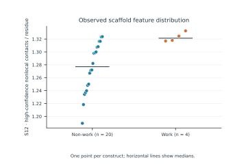
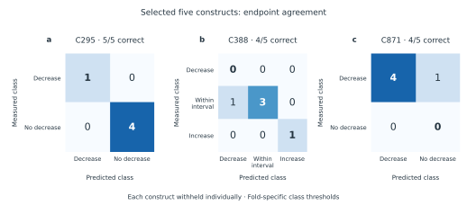

# Wiki figure captions

Figures are provided as SVG, PDF and 600-dpi PNG. Source tables are in [figure_data](../figure_data). Run [make_figures.py](../scripts/make_figures.py) for the original endpoint and sampling-support figures, and [add_wiki_figures.py](../scripts/add_wiki_figures.py) for the combined validation and added figures. These scripts use recorded data without retraining. No inferential statistics or uncertainty estimates are shown.

## Figure 1

Scaffold classification in two recorded evaluations. (a) Leave-one-construct-out (LOCO) evaluation in the expanded collection: 22/24 correct. (b) Four constructs withheld jointly: 3/4 correct, comprising one true positive, two true negatives and one false positive. Rows are measured classes and columns are predictions of the nine-feature random forest at a score threshold of 0.5. Both panels use the same colour scale for counts. The historical decision stump is a separate analysis.

## Figure 2

Observed S12 distribution across the expanded scaffold collection. Each point represents one construct (20 non-work; four work); horizontal lines indicate medians. S12 is the per-residue high-confidence nonlocal contact feature, pp_nonlocal12_high_per_res. Horizontal offsets separate observations and have no quantitative meaning. The overlapping distributions are descriptive and do not establish a universal decision threshold.

## Figure 3

Endpoint-level confusion matrices for the same five constructs. Agreement is 5/5 at C295, 4/5 at C388 and 4/5 at C871. All five C871 measurements belong to the decrease class, so C871 specificity cannot be estimated from this panel. Each construct was withheld individually; class thresholds are fold-specific.

## Figure 4

Sampling frequencies for the exact 17 consensus substitutions. Each value is the fraction of 10,000 generated sequences carrying the indicated residue in one model. Frequency describes structural sequence preference and does not estimate the probability of improved RNA editing.

