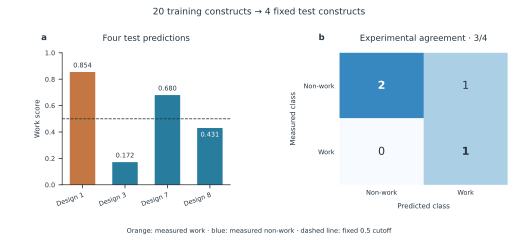
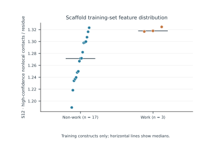
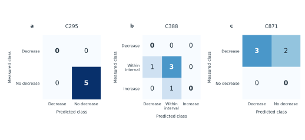
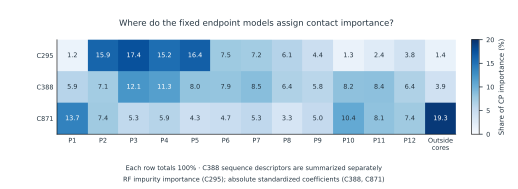
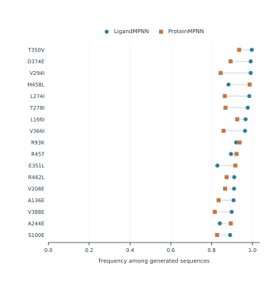

# Wiki figures and historical C388 panels

[Current binary C388 results](../../research/c388_binary/README.md). Figures 3 and 4 retain the former C388 three-class analysis.

[Full model page](../PUF_Model_EN.md) · [Fixed-test data and protocol](../../research/fixed_test_20260923/README.md). Figures 1–3 are generated by [make_fixed_test_figures.py](../scripts/make_fixed_test_figures.py); Figure 4 is generated by [make_repeat_importance.py](../scripts/make_repeat_importance.py); Figure 5 uses the unchanged MPNN sampling data.

## Figure 1

Figure 1. Four scaffold designs evaluated as one fixed test panel. (a) Work scores from the model fitted to twenty separate training constructs; the dashed line marks the fixed 0.5 cutoff. Colours show the subsequently measured class. (b) Comparison with experimental labels: one true positive, two true negatives and one false positive. All four designs were excluded together from preprocessing and fitting.

## Figure 2

Figure 2. S12 distribution in the twenty-construct training set: seventeen non-work and three work constructs. Each point represents one training construct; horizontal lines show medians. The four test designs are absent. S12 denotes high-confidence nonlocal contacts per residue; horizontal offsets only separate points.

## Figure 3

Figure 3 (historical C388 panel; not the current binary result). Endpoint predictions for the fixed five-construct test panel. All five constructs were excluded together from every fitting and selection step. The same endpoint-specific classifier and class boundaries apply to every test construct. Matrices show 5/5, 3/5 and 3/5 agreement for C295, C388 and C871, respectively. Rows are measured classes and columns are predictions.

## Figure 4

Figure 4 (historical C388 three-class attribution). Contact-feature importance across all twelve repeat cores and the outside-core region. Values are percentages of each endpoint’s total CP importance. C295 uses random-forest impurity importance; C388 and C871 use absolute standardized coefficients. C388 sequence descriptors are excluded from this CP-only normalization. All regions are shown, with no selection based on test performance.

## Figure 5

Figure 5. Sampling frequencies for the exact 17 consensus substitutions. Each value is the fraction of 10,000 generated sequences carrying the indicated residue in one model. Frequency describes structural sequence preference and does not estimate the probability of improved RNA editing.

## Module 2 workflow

`module2_workflow.png` is slide 3 of the supplied `dry_lab流程图(1).pptx`, rendered directly from the original presentation. It opens the main Wiki and repository landing page.
